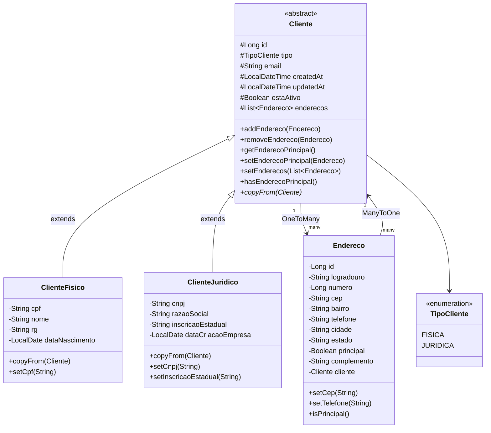

# Modelo de Entidades

## Diagrama ER

```mermaid
erDiagram
    Cliente {
        Long pk PK
        ENUM tipo "FISICA | JURIDICA"
        String email
        Boolean estaAtivo
        LocalDateTime created_at
        LocalDateTime updated_at
    }

    ClienteFisico {
        Long pk PK, FK
        String cpf "11 dígitos, unique"
        String nome
        String rg "9 dígitos"
        LocalDate data_nascimento
    }

    ClienteJuridico {
        Long pk PK, FK
        String cnpj "14 dígitos, unique"
        String razao_social
        String inscricao_estadual "9-14 dígitos"
        LocalDate data_criacao_empresa
    }

    Endereco {
        Long pk PK
        String logradouro
        Long numero
        String cep "8 dígitos"
        String bairro
        String telefone "11 dígitos"
        String cidade
        String estado "2 chars"
        Boolean endereco_principal
        String complemento
        Long cliente_id FK
        LocalDateTime created_at
        LocalDateTime updated_at
    }

    Cliente ||--o{ Endereco : "1:N"
    Cliente ||--o| ClienteFisico : "1:1 (Joined)"
    Cliente ||--o| ClienteJuridico : "1:1 (Joined)"
```

## Hierarquia de Herança



## Estratégia de Herança: JOINED

```mermaid
flowchart TD
    subgraph "Tabela: cliente"
        CT[PK: id\n tipo\n email\n esta_ativo\n created_at\n updated_at]
    end
    subgraph "Tabela: cliente_fisico"
        CFT[PK: id (FK→cliente)\n cpf\n nome\n rg\n data_nascimento]
    end
    subgraph "Tabela: cliente_juridico"
        CJT[PK: id (FK→cliente)\n cnpj\n razao_social\n inscricao_estadual\n data_criacao_empresa]
    end
    subgraph "Tabela: endereco"
        ET[PK: id\n logradouro\n numero\n cep\n ...\n cliente_id (FK→cliente)]
    end

    CT -->|"1:1"| CFT
    CT -->|"1:1"| CJT
    CT -->|"1:N"| ET

    style CT fill:#e1f5fe
    style CFT fill:#fff3e0
    style CJT fill:#e8f5e9
    style ET fill:#fce4ec
```

## Relacionamentos Detalhados

### Cliente ↔ Endereco (Bidirecional)

| Tipo | Lado | Anotação | mappedBy |
|------|------|----------|----------|
| OneToMany | `Cliente.enderecos` | `@OneToMany(cascade=ALL, orphanRemoval=true)` | `"cliente"` |
| ManyToOne | `Endereco.cliente` | `@ManyToOne(optional=false)` | — |

**Regras de negócio em `Cliente`:**
- `addEndereco()` — primeiro endereço vira principal automaticamente; se o adicionado for principal, rebaixa os demais
- `removeEndereco()` — bloqueia remoção do único endereço; se o removido era principal, promove o primeiro
- `setEnderecos(List)` — valida que pelo menos um endereço existe e pelo menos um é principal
- `getEnderecoPrincipal()` — busca o endereço marcado como principal ou retorna o primeiro

### Limpeza de Formatação nos Setters

Várias entidades limpam a formatação automaticamente nos setters:

| Entidade | Campo | Limpeza |
|----------|-------|---------|
| `ClienteFisico` | `cpf` | `replaceAll("\\D", "")` |
| `ClienteJuridico` | `cnpj` | `replaceAll("\\D", "")` |
| `ClienteJuridico` | `inscricaoEstadual` | `replaceAll("\\D", "")` |
| `Endereco` | `cep` | `replaceAll("\\D", "")` |
| `Endereco` | `telefone` | `replaceAll("\\D", "")` |
