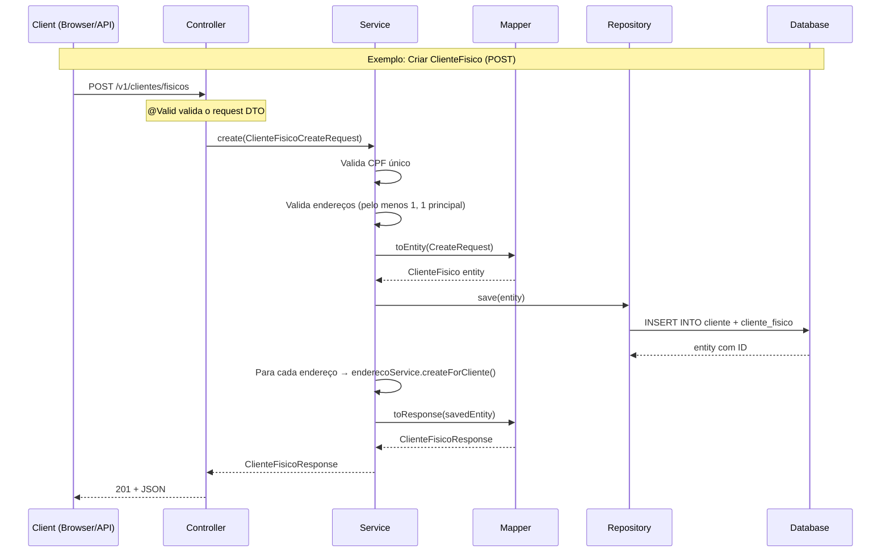

# Controllers REST

## Diagrama de Controllers

```mermaid
classDiagram
    class ClienteFisicoController {
        -ClienteFisicoService fisicoService
        +getAll(Pageable) ResponseEntity~Page~
        +getAllActive(Pageable) ResponseEntity~Page~
        +getById(Long) ResponseEntity~ClienteFisicoResponse~
        +getByCpf(String) ResponseEntity~ClienteFisicoResponse~
        +existsByCpf(String) ResponseEntity~Boolean~
        +create(ClienteFisicoCreateRequest) ResponseEntity
        +update(Long, ClienteFisicoUpdateRequest) ResponseEntity
        +activate(Long) ResponseEntity~Void~
        +inactivate(Long) ResponseEntity~Void~
        +softDelete(Long) ResponseEntity~Void~
        +hardDelete(Long) ResponseEntity~Void~
        +getReport(Pageable) ResponseEntity~Page~
    }

    class ClienteJuridicoController {
        -ClienteJuridicoService juridicoService
        +getAll(Pageable) ResponseEntity~Page~
        +getAllActive(Pageable) ResponseEntity~Page~
        +getById(Long) ResponseEntity~ClienteJuridicoResponse~
        +getByCnpj(String) ResponseEntity~ClienteJuridicoResponse~
        +existsByCnpj(String) ResponseEntity~Boolean~
        +create(ClienteJuridicoCreateRequest) ResponseEntity
        +update(Long, ClienteJuridicoUpdateRequest) ResponseEntity
        +activate(Long) ResponseEntity~Void~
        +inactivate(Long) ResponseEntity~Void~
        +hardDelete(Long) ResponseEntity~Void~
        +getReport(Pageable) ResponseEntity~Page~
    }

    class EnderecoController {
        -EnderecoService enderecoService
        +create(EnderecoCreateRequest) ResponseEntity
        +createForCliente(Long, EnderecoWithinClienteCreateRequest) ResponseEntity
        +findById(Long) ResponseEntity~EnderecoResponse~
        +findAllByClienteId(Long, Pageable) ResponseEntity~Page~
        +findPrincipalByClienteId(Long) ResponseEntity~EnderecoResponse~
        +countByClienteId(Long) ResponseEntity~Long~
        +update(Long, EnderecoUpdateRequest) ResponseEntity
        +setAsPrincipal(Long) ResponseEntity
        +delete(Long) ResponseEntity~Void~
        +deleteAllByClienteId(Long) ResponseEntity~Void~
        +hasAtLeastOneAddress(Long) ResponseEntity~Boolean~
        +hasPrincipalAddress(Long) ResponseEntity~Boolean~
    }

    class ExportController {
        -ExportService exportService
        +exportClientesFisicosToPdf() ResponseEntity~byte[]~
        +exportClientesJuridicosToPdf() ResponseEntity~byte[]~
    }
```

## Endpoints — ClienteFisicoController

**Base:** `/v1/clientes/fisicos`

| Método | Path | Função | Request | Response |
|--------|------|--------|---------|----------|
| GET | `/` | Listar todos | `Pageable` | `Page<ClienteFisicoListResponse>` |
| GET | `/ativos` | Listar ativos | `Pageable` | `Page<ClienteFisicoListResponse>` |
| GET | `/{id}` | Buscar por ID | — | `ClienteFisicoResponse` |
| GET | `/cpf/{cpf}` | Buscar por CPF | — | `ClienteFisicoResponse` |
| GET | `/cpf/{cpf}/exists` | Verificar CPF | — | `Boolean` |
| POST | `/` | Criar | `@Valid ClienteFisicoCreateRequest` | `201 + ClienteFisicoResponse` |
| PUT | `/{id}` | Atualizar | `@Valid ClienteFisicoUpdateRequest` | `ClienteFisicoResponse` |
| PATCH | `/{id}/ativar` | Ativar | — | `204` |
| PATCH | `/{id}/inativar` | Inativar (soft) | — | `204` |
| DELETE | `/{id}` | Soft delete | — | `204` |
| DELETE | `/{id}/permanent` | Hard delete | — | `204` |
| GET | `/relatorio` | Relatório | `Pageable` | `Page<ClienteFisicoReportResponse>` |

## Endpoints — ClienteJuridicoController

**Base:** `/v1/clientes/juridicos`

| Método | Path | Função | Request | Response |
|--------|------|--------|---------|----------|
| GET | `/` | Listar todos | `Pageable` | `Page<ClienteJuridicoListResponse>` |
| GET | `/ativos` | Listar ativos | `Pageable` | `Page<ClienteJuridicoListResponse>` |
| GET | `/{id}` | Buscar por ID | — | `ClienteJuridicoResponse` |
| GET | `/cnpj/{cnpj}` | Buscar por CNPJ | — | `ClienteJuridicoResponse` |
| GET | `/cnpj/{cnpj}/exists` | Verificar CNPJ | — | `Boolean` |
| POST | `/` | Criar | `@Valid ClienteJuridicoCreateRequest` | `201 + ClienteJuridicoResponse` |
| PUT | `/{id}` | Atualizar | `@Valid ClienteJuridicoUpdateRequest` | `ClienteJuridicoResponse` |
| PATCH | `/{id}/ativar` | Ativar | — | `204` |
| PATCH | `/{id}/inativar` | Inativar (soft) | — | `204` |
| DELETE | `/{id}` | Hard delete | — | `204` |
| GET | `/relatorio` | Relatório | `Pageable` | `Page<ClienteJuridicoReportResponse>` |

## Endpoints — EnderecoController

**Base:** `/v1/enderecos`

| Método | Path | Função | Request | Response |
|--------|------|--------|---------|----------|
| POST | `/` | Criar endereço | `@Valid EnderecoCreateRequest` | `201 + EnderecoResponse` |
| POST | `/clientes/{clienteId}` | Criar p/ cliente | `@Valid EnderecoWithinClienteCreateRequest` | `201 + EnderecoResponse` |
| GET | `/{id}` | Buscar por ID | — | `EnderecoResponse` |
| GET | `/clientes/{clienteId}` | Listar do cliente | `Pageable` | `Page<EnderecoListResponse>` |
| GET | `/clientes/{clienteId}/principal` | Principal | — | `EnderecoResponse` |
| GET | `/clientes/{clienteId}/count` | Contar | — | `Long` |
| PUT | `/{id}` | Atualizar | `@Valid EnderecoUpdateRequest` | `EnderecoResponse` |
| PATCH | `/{id}/principal` | Definir principal | — | `EnderecoResponse` |
| DELETE | `/{id}` | Deletar | — | `204` |
| DELETE | `/clientes/{clienteId}` | Deletar todos | — | `204` |
| GET | `/clientes/{clienteId}/has-addresses` | Tem endereços? | — | `Boolean` |
| GET | `/clientes/{clienteId}/has-principal` | Tem principal? | — | `Boolean` |

## Endpoints — ExportController

**Base:** `/v1/export`

| Método | Path | Função | Response |
|--------|------|--------|----------|
| GET | `/clientes/fisicos/pdf` | PDF clientes físicos | `application/pdf` |
| GET | `/clientes/juridicos/pdf` | PDF clientes jurídicos | `application/pdf` |

## Fluxo de Requisição REST

