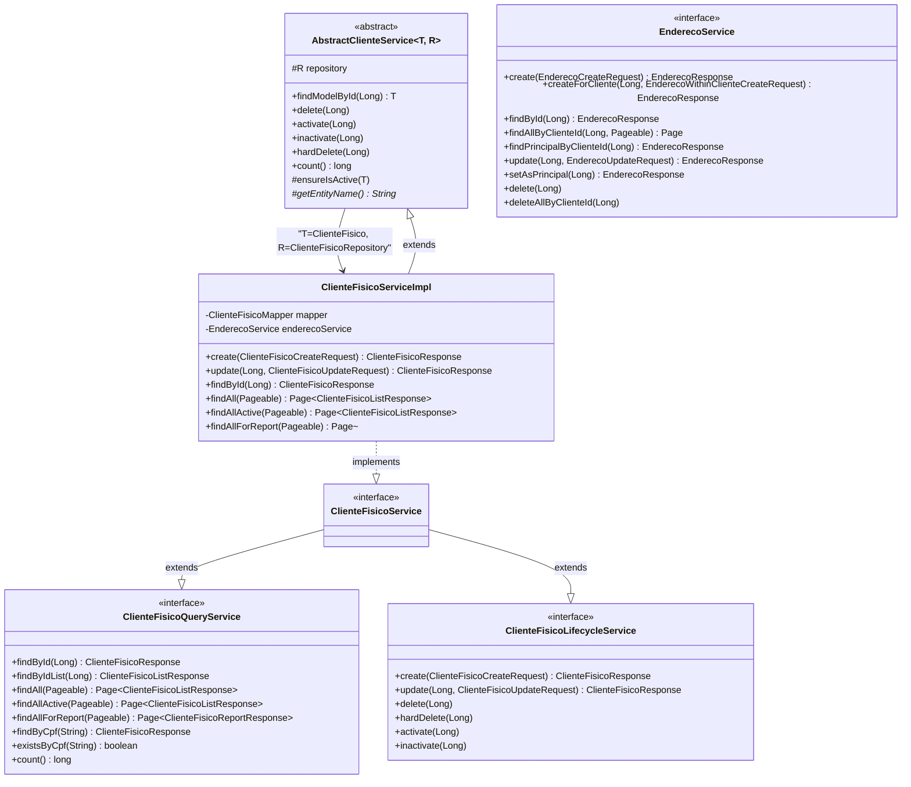
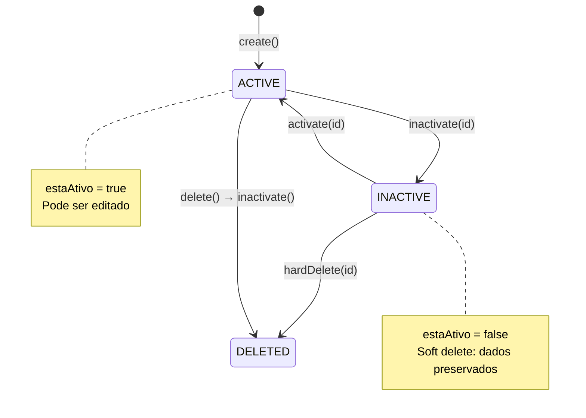
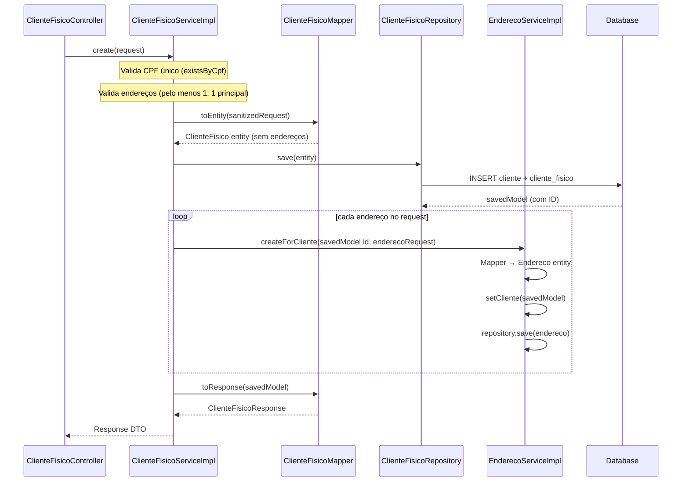

# Service Layer

## Hierarquia de Interfaces e Classes



## CQRS no Service Layer

As interfaces de serviço seguem o padrão **CQRS lógico** (segregação de interfaces, não de bancos):

```mermaid
flowchart LR
    subgraph "Query (Read)"
        QI[Cliente*QueryService\nfindById, findAll, findAllActive\nfindByCpf, existsByCpf, count]
    end
    subgraph "Lifecycle (Write)"
        LI[Cliente*LifecycleService\ncreate, update, delete\nactivate, inactivate, hardDelete]
    end
    subgraph "Service Interface"
        SI[Cliente*Service]
    end
    subgraph "Implementation"
        IMPL[Cliente*ServiceImpl\n@Service @Transactional]
    end

    QI --> SI
    LI --> SI
    SI --> IMPL
    IMPL -->|mapper.toEntity| MAP[MapStruct Mapper]
    IMPL -->|repository.save| REPO[Repository]
    IMPL -->|mapper.toResponse| DTO
```

## Métodos do AbstractClienteService



A classe `AbstractClienteService<T, R>` fornece:

| Método | Visibilidade | `@Transactional` | Descrição |
|--------|-------------|------------------|-----------|
| `findModelById(Long)` | `public` | readOnly | Busca entidade ou lança `ResourceNotFoundException` |
| `ensureIsActive(T)` | `protected` | — | Verifica se entidade está ativa, senão lança `BusinessException` |
| `delete(Long)` | `public` | sim | Chama `inactivate(id)` — soft delete |
| `activate(Long)` | `public` | sim | Ativa cliente, valida se já não está ativo |
| `inactivate(Long)` | `public` | sim | Inativa cliente, valida se já não está inativo |
| `hardDelete(Long)` | `public` | sim | Remove fisicamente do banco |
| `count()` | `public` | readOnly | Total de registros |

## Fluxo: Criação de ClienteFisico


