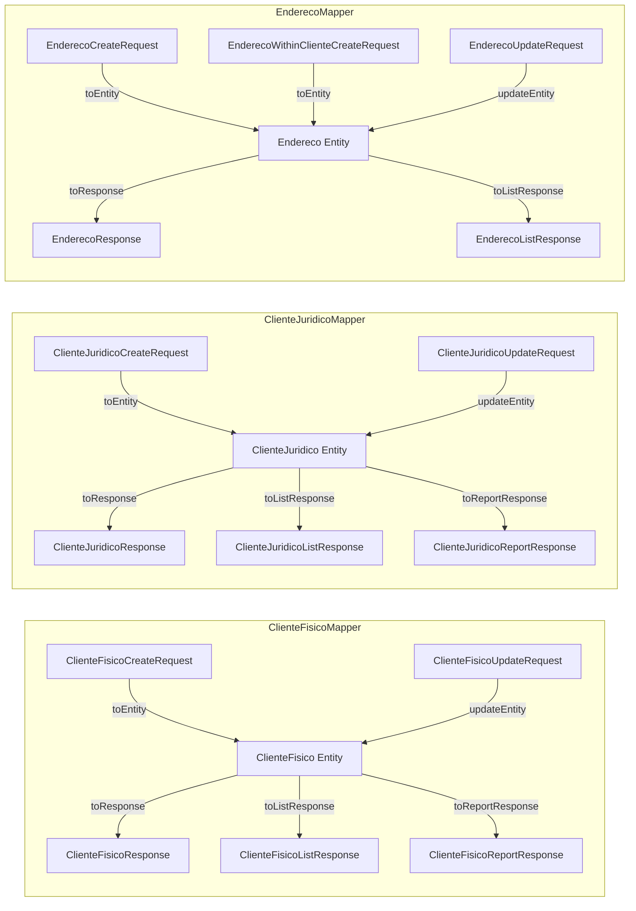
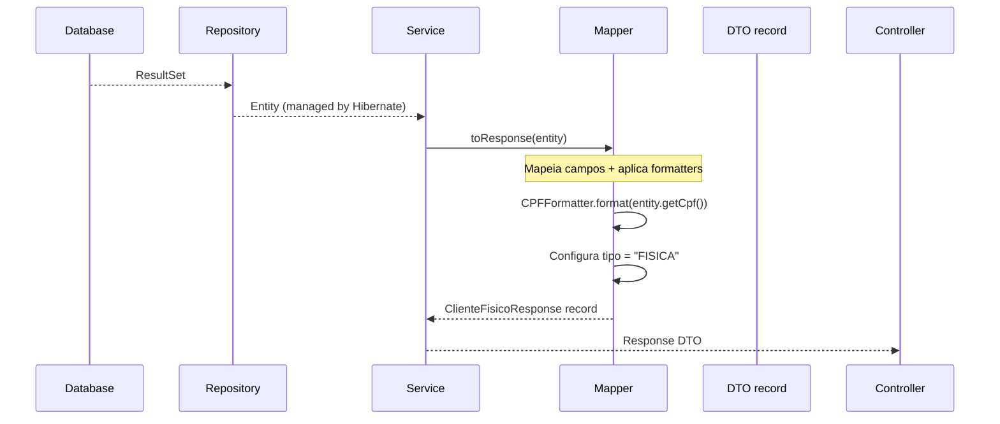

# DTOs e Mappers (MapStruct)

## Filosofia da Camada

```
┌─────────────────────────────────────────────────────┐
│                   ENTITY (JPA)                       │
│   ClienteFisico, ClienteJuridico, Endereco           │
│   → Objetos gerenciados pelo Hibernate               │
│   → Nunca expostos diretamente ao cliente            │
└──────────────┬──────────────────────────────────────┘
               │
               ▼
┌─────────────────────────────────────────────────────┐
│              MAPSTRUCT MAPPER (compile-time)         │
│   ClienteFisicoMapper, ClienteJuridicoMapper,        │
│   EnderecoMapper                                     │
│   → Gera código de conversão em tempo de compilação  │
│   → Injeção de dependência via @Mapper(componentModel │
│     = MappingConstants.ComponentModel.SPRING)        │
└──────────────┬──────────────────────────────────────┘
               │
               ▼
┌─────────────────────────────────────────────────────┐
│               DTO (record imutável)                  │
│   CreateRequest | UpdateRequest | Response           │
│   ListResponse | ReportResponse                      │
│   → records Java (imutáveis por design)              │
│   → Anotações de validação (Bean Validation)         │
│   → Serializáveis (para Wicket)                      │
└─────────────────────────────────────────────────────┘
               │
               ▼
┌─────────────────────────────────────────────────────┐
│           FORMMODEL (mutable bean - Wicket)          │
│   ClienteFisicoCreateFormModel                       │
│   → POJOs mutáveis (getters/setters)                 │
│   → Necessários para CompoundPropertyModel do Wicket │
│   → Convertidos para DTO no onSubmit()               │
└─────────────────────────────────────────────────────┘
```

## MapStruct Mappers



## DTOs por Tipo

### ClienteFisico (5 DTOs)

| DTO | Uso | Campos |
|-----|-----|--------|
| `ClienteFisicoCreateRequest` | POST body | `cpf, nome, rg, email, dataNascimento, enderecos[]` |
| `ClienteFisicoUpdateRequest` | PUT body | `nome, email, estaAtivo` |
| `ClienteFisicoResponse` | GET response | `id, tipo, cpf, nome, rg, email, dataNascimento, estaAtivo, enderecos[], createdAt, updatedAt` |
| `ClienteFisicoListResponse` | Lista paginada | `id, nome, cpf, email, estaAtivo` |
| `ClienteFisicoReportResponse` | Relatório | (via MapStruct) |

### ClienteJuridico (5 DTOs)

| DTO | Uso | Campos |
|-----|-----|--------|
| `ClienteJuridicoCreateRequest` | POST body | `cnpj, razaoSocial, inscricaoEstadual, email, dataCriacaoEmpresa, enderecos[]` |
| `ClienteJuridicoUpdateRequest` | PUT body | `razaoSocial, inscricaoEstadual, email, dataCriacaoEmpresa, estaAtivo, enderecos` |
| `ClienteJuridicoResponse` | GET response | `id, tipo, cnpj, razaoSocial, inscricaoEstadual, email, dataCriacaoEmpresa, estaAtivo, enderecos[], createdAt, updatedAt` |
| `ClienteJuridicoListResponse` | Lista paginada | `id, razaoSocial, cnpj, email, estaAtivo` |
| `ClienteJuridicoReportResponse` | Relatório | (via MapStruct) |

### Endereco (5 DTOs)

| DTO | Uso | Campos |
|-----|-----|--------|
| `EnderecoCreateRequest` | POST body | `logradouro, numero, cep, bairro, telefone, estado, cidade, principal, complemento, clienteId` |
| `EnderecoWithinClienteCreateRequest` | POST body (dentro de cliente) | `logradouro, numero, cep, bairro, telefone, estado, cidade, principal, complemento` (sem clienteId) |
| `EnderecoUpdateRequest` | PUT body | `logradouro, numero, cep, bairro, telefone, estado, cidade, principal, complemento` |
| `EnderecoResponse` | GET response | `id, logradouro, numero, cep, bairro, telefone, estado, cidade, principal, complemento, clienteId, createdAt, updatedAt` |
| `EnderecoListResponse` | Lista paginada | (via MapStruct) |

## Fluxo: Entity → Response



## Formatters (Expressões MapStruct)

Os mappers usam `expression` para aplicar formatação nos responses:

```java
// ClienteFisicoMapper.java
@Mapping(target = "cpf", expression = "java(com.desafio.estagio.model.formatter.CPFFormatter.format(entity.getCpf()))")
ClienteFisicoResponse toResponse(ClienteFisico entity);
```

| Formatter | Função | Exemplo |
|-----------|--------|---------|
| `CPFFormatter` | `00000000000` → `000.000.000-00` | Formatação padrão CPF |
| `CNPJFormatter` | `00000000000000` → `00.000.000/0000-00` | Formatação padrão CNPJ |
| `CEPFormatter` | `00000000` → `00000-000` | Formatação padrão CEP |
| `TelefoneFormatter` | `5511999999999` → `(11) 99999-9999` | Formatação telefone |
