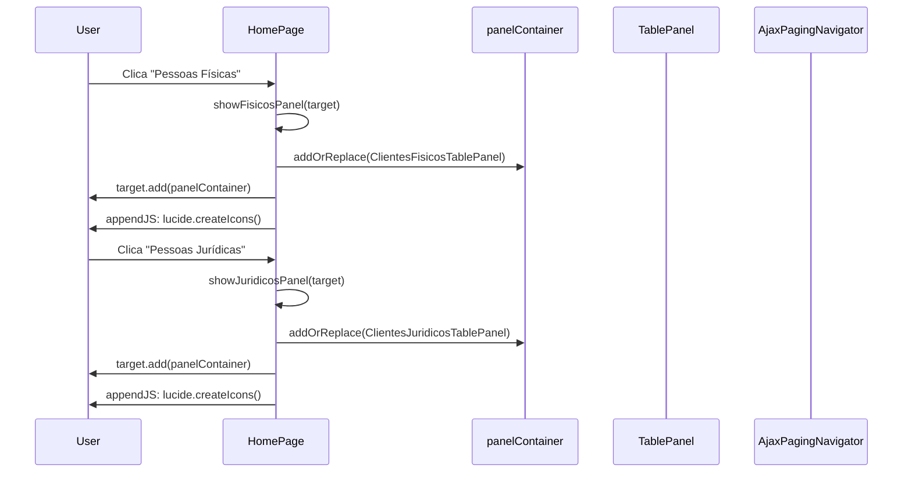
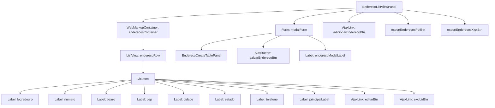

# Wicket Pages e Navegação

## Arquitetura de Páginas

```mermaid
graph TB
    WA[WicketApplication<br/>extends WebApplication] -->|mountPage /| HP[HomePage]
    WA -->|mountPage /clientes/detalhe/${clienteId}| CFDP[ClienteFisicoDetalhePage]
    WA --> CJDP[ClienteJuridicoDetalhePage<br/>(bookmarkable)]

    subgraph "Base"
        BP[BasePage<br/>extends WebPage]
        BP -->|DebugBar| DB[DebugBar]
    end

    subgraph "HomePage"
        HP -->|extends| BP
        HP -->|AjaxLink btnFisicos| CFTP[ClientesFisicosTablePanel]
        HP -->|AjaxLink btnJuridicos| CJTP[ClientesJuridicosTablePanel]
        HP -->|WebMarkupContainer| WMC[panelContainer]
        CFTP -->|addOrReplace| WMC
        CJTP -->|addOrReplace| WMC
    end

    subgraph "Detalhe Pages"
        CFDP -->|extends| BP
        CFDP -->|@SpringBean| CFS[ClienteFisicoService]
        CFDP -->|Label| LB[Labels: id, nome, cpf, rg...]
        CFDP -->|EnderecoListViewPanel| ELVP[EnderecoListViewPanel]
        CFDP -->|BookmarkablePageLink| BPL[← Voltar]

        CJDP -->|extends| BP
        CJDP -->|@SpringBean| CJS[ClienteJuridicoService]
        CJDP -->|EnderecoListViewPanel| ELVP2[EnderecoListViewPanel]
    end

    CFTP -->|ClienteFisicoCreateModal| CFCM[Create Modal]
    CFTP -->|exportPdf/xlsx| EXP[Export Links]
    CJTP -->|ClienteJuridicoCreateModal| CJCM[Create Modal]
    CJTP -->|exportPdf/xlsx| EXP2[Export Links]

    CFDP -->|BookmarkablePageLink| HP
    CJDP -->|BookmarkablePageLink| HP
```

## HomePage — Toggle de Painéis



## Component Hierarchy — ClientesFisicosTablePanel

```
ClientesFisicosTablePanel (DevUtilsPanel)
├── tableContainer (WebMarkupContainer)
│   └── rows (ClienteFisicoDataView)
│       └── Item
│           └── editarForm (ClienteFisicoRowUpdateForm)
│               ├── id (Label) — CompoundPropertyModel binds to FormModel
│               ├── cpf (Label)
│               ├── nome (TextField)
│               ├── email (TextField)
│               ├── status (Label) — "Ativo"/"Inativo"
│               ├── statusBtn (AjaxLink) — toggle active/inactive
│               ├── detalhesBtn (BookmarkablePageLink → DetalhePage)
│               └── editarBtn (AjaxButton) — submit update
├── navigator (AjaxPagingNavigator)
├── exportPdfBtn (Link) → ExportService.pdfFisicos()
├── exportXlsxBtn (Link) → ExportService.xlsxFisicos()
└── createModal (ClienteFisicoCreateModal)
    └── form (Form)
        ├── CompoundPropertyModel → ClienteFisicoCreateFormModel
        ├── cpf (TextField + StringValidator)
        ├── nome (TextField + StringValidator)
        ├── rg (TextField + StringValidator)
        ├── email (TextField)
        ├── dataNascimento (TextField, type=date)
        ├── enderecosContainer (EnderecoCreateTablePanel)
        │   └── enderecosRow (ListView)
        │       └── Item
        │           ├── logradouro, numero, bairro, cep...
        │           ├── principal (CheckBox)
        │           └── removeBtn (AjaxLink)
        │   └── addEndereco (AjaxLink)
        └── submit (AjaxButton) → cria ClienteFisico
```

## DetalhePage — Exibição de Dados

```mermaid
flowchart LR
    TP[TablePanel] -->|"BookmarkablePageLink\n?clienteId=123"| DP[DetalhePage]

    DP -->|constructor| SRV[Service.findById(id)]
    SRV -->|Cliente*Response| DP

    subgraph "Page Components"
        DP --> L1[Label: clienteId]
        DP --> L2[Label: clienteNome / clienteRazaoSocial]
        DP --> L3[Label: clienteCpf / clienteCnpj]
        DP --> L4[Label: clienteRg / clienteInscricaoEstadual]
        DP --> L5[Label: clienteEmail]
        DP --> L6[Label: clienteDataNascimento / clienteDataCriacaoEmpresa]
        DP --> L7[Label: clienteStatus]
        DP --> EP["EnderecoListViewPanel\n(shared component)"]
    end

    DP -->|BookmarkablePageLink| HP[HomePage ← Voltar]
```

## EnderecoListViewPanel


