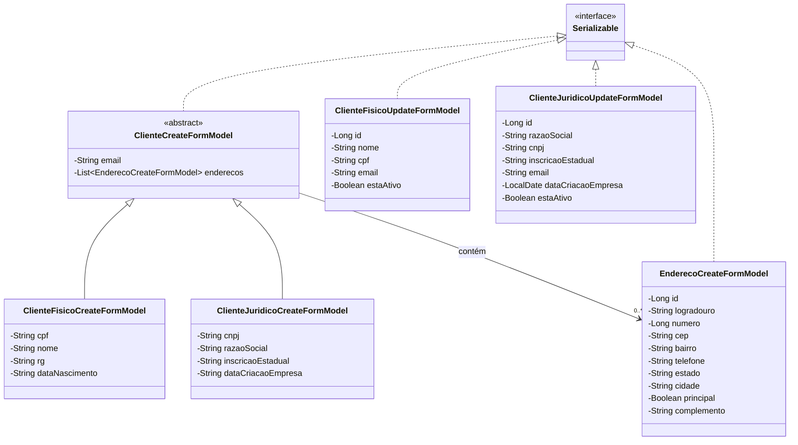
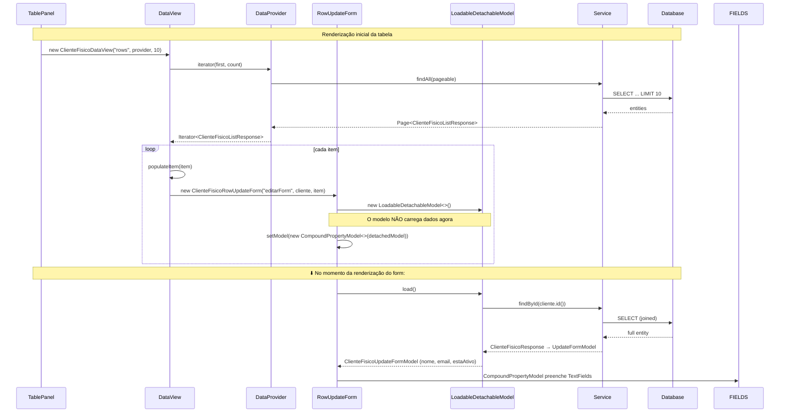
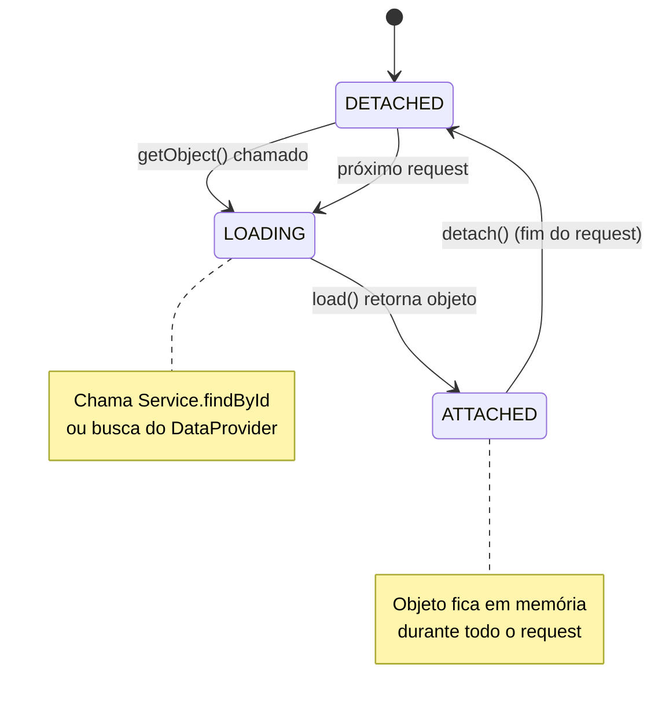

# Modelos Wicket: CompoundPropertyModel, LoadableDetachableModel, FormModels

## Hierarquia de FormModels



## Arquitetura de Models no Wicket

```mermaid
flowchart TD
    subgraph "Wicket Form Edit (Inline)"
        RF[RowUpdateForm]
        RF --> CPM1[CompoundPropertyModel]
        CPM1 --> LDM1[LoadableDetachableModel]
        LDM1 -->|load()| SRV1[Service.findById]
        SRV1 --> DTO_RES1[Response DTO]
        DTO_RES1 --> UM[UpdateFormModel]
        UM -->|visualiza/edita| FIELDS[TextFields + Labels]
        FIELDS -->|onSubmit| AJAX1[AjaxButton]
        AJAX1 -->|cria| UPD_DTO[UpdateRequest DTO]
        UPD_DTO --> SRV1
    end

    subgraph "Wicket Create Modal"
        CM[CreateModal]
        CM --> CPM2[CompoundPropertyModel]
        CPM2 --> FMM[CreateFormModel]
        FMM -->|bind| INPUTS[Form Inputs]
        INPUTS -->|onSubmit| AJAX2[AjaxButton]
        AJAX2 -->|converte manualmente| CR_DTO[CreateRequest DTO]
        AJAX2 -->|inclui| END_DTOS["List<EnderecoWithinClienteCreateRequest>"]
        CR_DTO --> SRV2[Service.create]
    end

    subgraph "Wicket DataProvider"
        DP[AbstractClienteDataProvider]
        DP -->|iterator()| PAGED[Pageable → Service.findAll]
        DP -->|model(T)| LDM2[LoadableDetachableModel]
        LDM2 -->|load()| SRV3[Service.findByIdList]
        SRV3 --> LIST_DTO[ListResponse DTO]
    end

    subgraph "DetalhePage"
        DPAGE[DetalhePage]
        DPAGE -->|constructor| SRV4[Service.findById]
        SRV4 --> RES_DTO[Response DTO]
        RES_DTO -->|Label.setText| LABELS[Static Labels]
    end
```

## CompoundPropertyModel + LoadableDetachableModel (Row Update)



## Por que FormModels (mutáveis) vs DTOs (imutáveis)?

```mermaid
flowchart LR
    subgraph "Java Side"
        DTO[DTO record<br/>imutável]
        FM[FormModel POJO<br/>mutável]
    end

    subgraph "Wicket Internals"
        CPM[CompoundPropertyModel]
        WB["getObject() / setObject()"]
    end

    DTO --x|"❌ records são final\nsem setters"| CPM
    FM -->|"✅ getNome() / setNome()"| CPM
    CPM -->|"property="nome""| WB
    WB -->|"textField.getInput()"| FM.setNome()

    note[Wicket precisa chamar setters\npara atualizar o model object.\nRecords não permitem mutação.\nLogo: FormModel é necessário.]
```

## Mapa: Conversão FormModel → DTO → Entity

### Criação (ClienteFisicoCreateModal)

```
ClienteFisicoCreateFormModel                  ClienteFisicoCreateRequest (record)
├── cpf (String)                    ───────→  ├── cpf (String)  ← limpo: replaceAll("\\D","")
├── nome (String)                   ───────→  ├── nome (String)
├── rg (String)                     ───────→  ├── rg (String)   ← limpo
├── email (String)                  ───────→  ├── email (String)
├── dataNascimento (String)        ───────→  ├── dataNascimento (LocalDate) ← parse
└── enderecos (List<EnderecoCreateFormModel>)  └── enderecos (List<EnderecoWithinClienteCreateRequest>)
    ├── logradouro, numero                      ├── logradouro, numero
    ├── cep (String)                            ├── cep (limpo)
    ├── telefone (String)                       ├── telefone (limpo)
    └── principal (Boolean)                     └── principal (Boolean)

ClienteFisicoCreateRequest (record)       ClienteFisico (entity) [via MapStruct]
├── cpf                             ─────→  ├── cpf
├── nome                            ─────→  ├── nome
├── ...                             ─────→  ├── ...
│                                          └── enderecos (ignored, handled by EnderecoService)
```

### Edição (ClienteFisicoRowUpdateForm)

```
ClienteFisicoResponse (record)             ClienteFisicoUpdateFormModel (POJO)
├── id() = 1                     ───────→  ├── id = 1
├── nome() = "João"              ───────→  ├── nome = "João"
├── email() = "joao@email.com"   ───────→  ├── email = "joao@email.com"
├── cpf() = "123.456.789-01"     ───────→  ├── cpf = "123.456.789-01"
└── estaAtivo() = true           ───────→  └── estaAtivo = true

ClienteFisicoUpdateFormModel (POJO)        ClienteFisicoUpdateRequest (record)
├── nome = "João S."            ───────→  ├── nome = "João S."
├── email = "joao@email.com"     ───────→  ├── email = "joao@email.com"
└── estaAtivo = false            ───────→  └── estaAtivo = false

ClienteFisicoUpdateRequest (record)        ClienteFisico (entity) [via MapStruct @MappingTarget]
└── nome, email, estaAtivo      ───────→  ├── setNome(), setEmail(), setEstaAtivo()
                                           └── outros campos ignorados (nullValuePropertyMappingStrategy = IGNORE)
```

## LoadableDetachableModel — Ciclo de Vida


