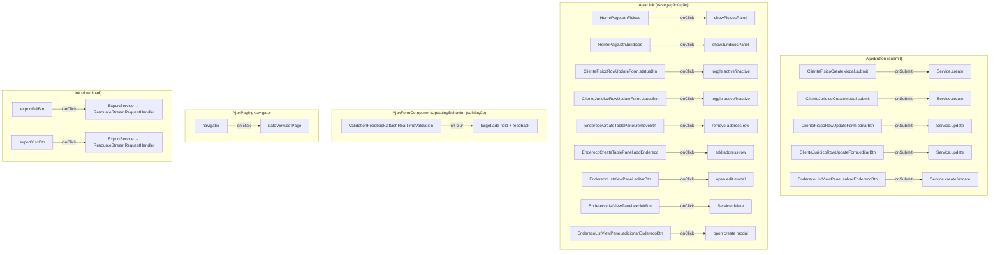
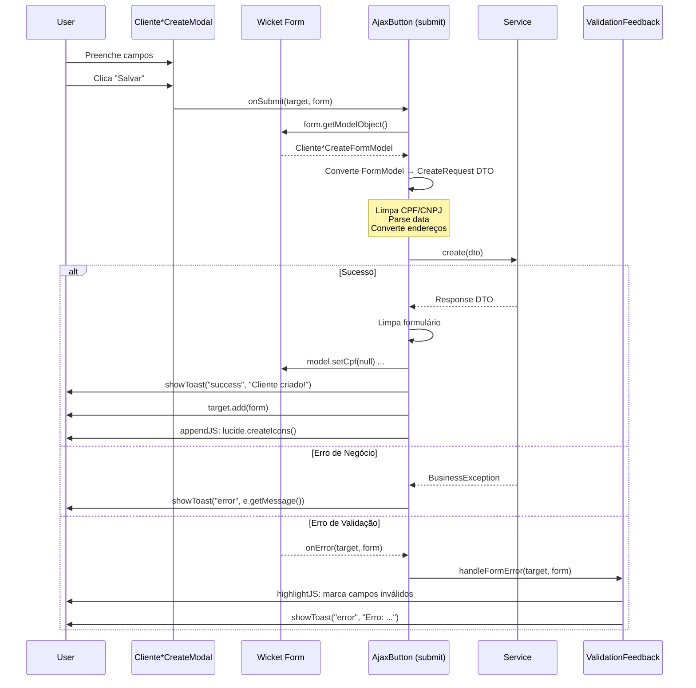
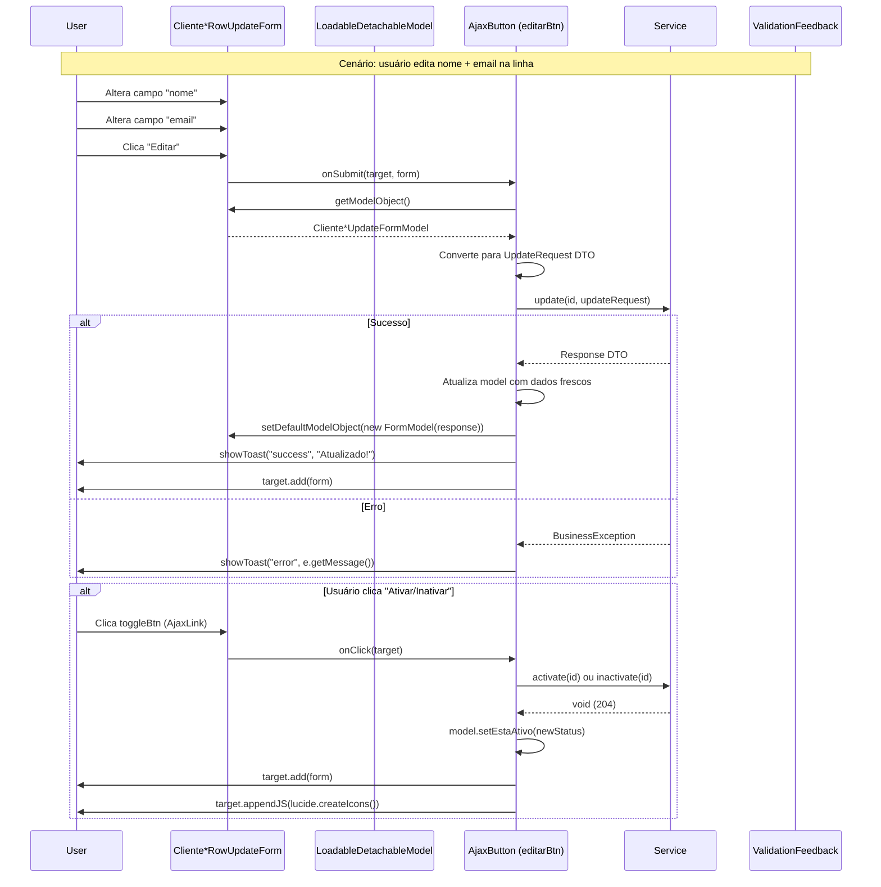
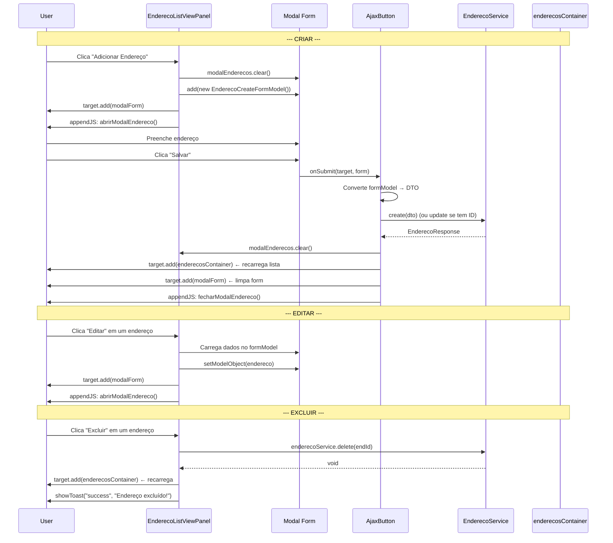
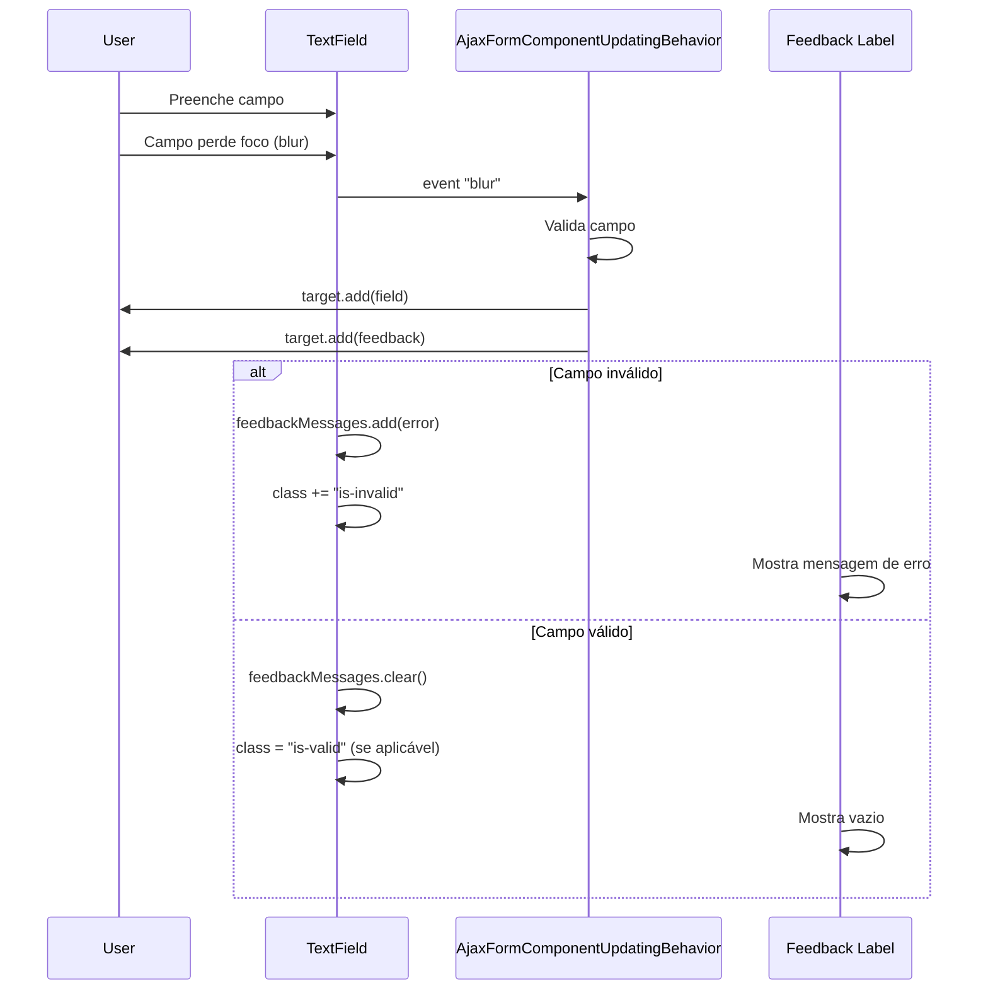
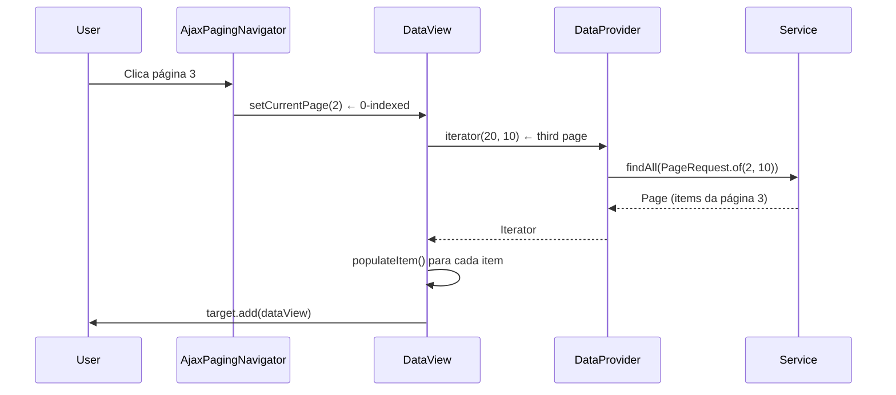

# Ajax Behaviors e Interatividade

## Catálogo de Ajax Behaviors



## Fluxo Ajax: Criação de Cliente (Modal)



## Fluxo Ajax: Edição Inline (RowUpdateForm)



## Fluxo Ajax: Endereços (CRUD completo)



## Validação em Tempo Real (AjaxFormComponentUpdatingBehavior)



## Validação no Submit (handleFormError)

```mermaid
flowchart LR
    AJAX[AjaxButton.onError]

    AJAX --> COL[FeedbackCollector.collect(form)]
    COL --> FILTER[Filtra: level == ERROR]

    FILTER --> ERR_BUILD[Concatena mensagens]
    FILTER --> JS_BUILD[Gera JS para highlight]

    ERR_BUILD --> TOAST[showToast error]
    JS_BUILD --> HIGHLIGHT[appendJS: marca is-invalid]
    TOAST --> TARGET[target.add(form)]
    HIGHLIGHT --> TARGET
```

## AjaxPagingNavigator


