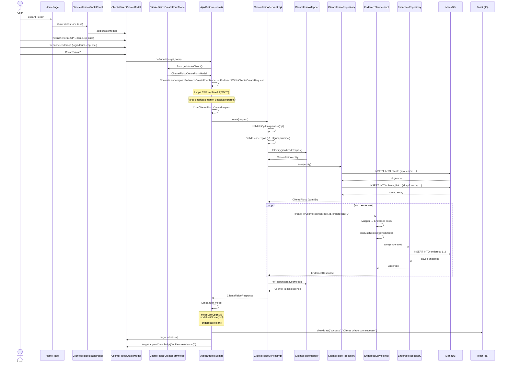
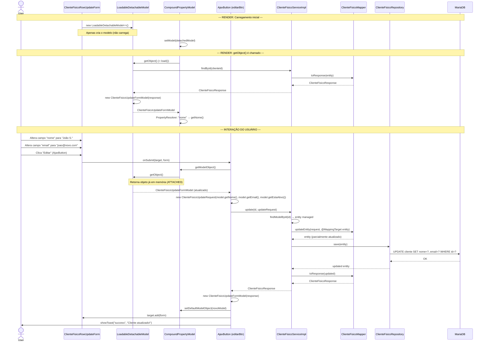
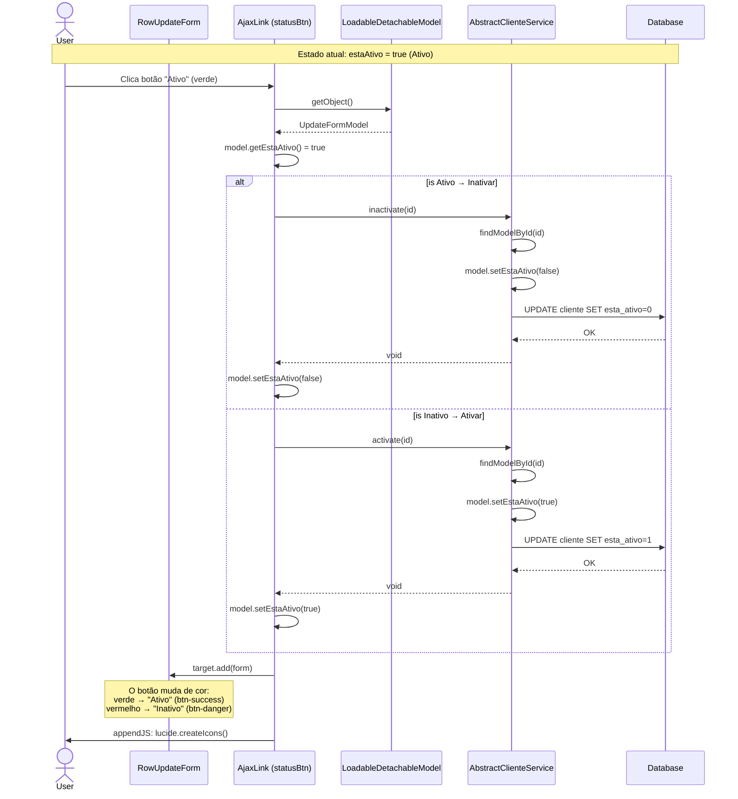
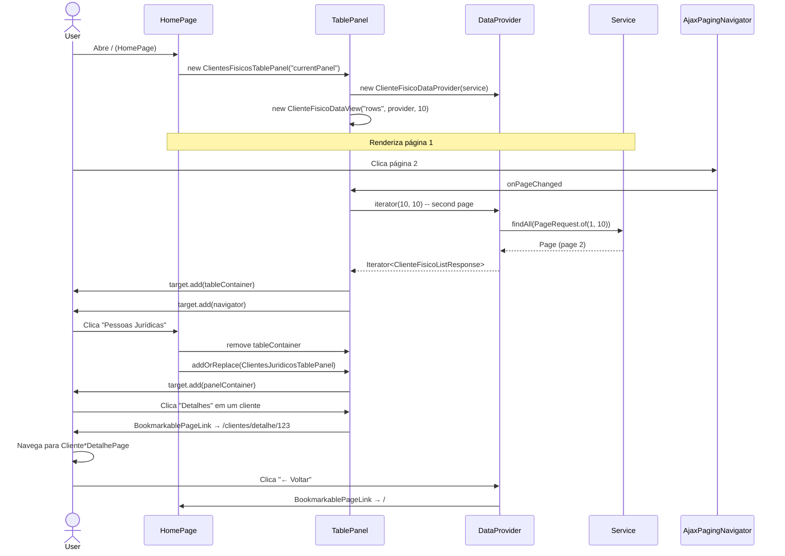
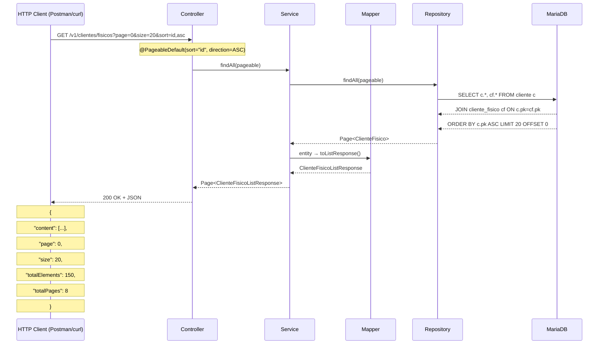
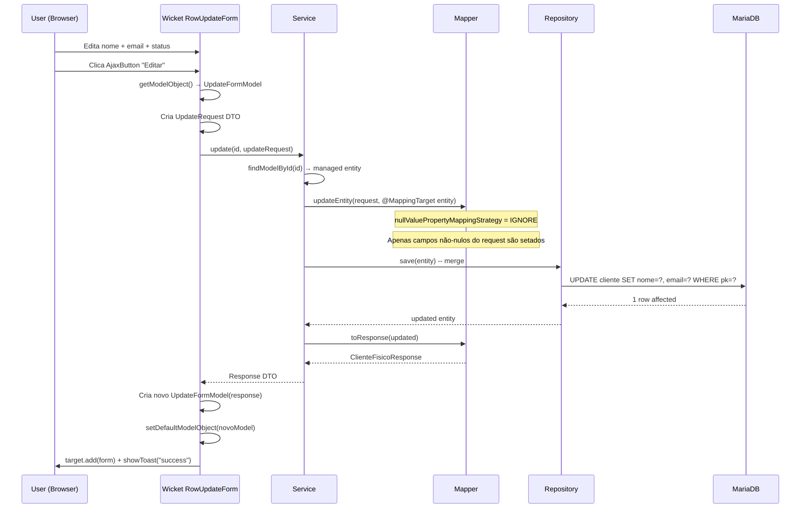

# Diagramas de Sequência — Fluxos Completos

## Fluxo 1: Criar ClienteFisico (Wicket → Service → DB)



## Fluxo 2: Editar Cliente Inline (RowUpdateForm)



## Fluxo 3: Toggle Ativar/Inativar



## Fluxo 4: Navegação entre Páginas Wicket



## Fluxo 5: Exportação (PDF/XLSX)

```mermaid
sequenceDiagram
    actor User
    participant TP as TablePanel
    participant LINK as Link (exportBtn)
    participant EX_SRV as ExportService
    participant JRSRV as JasperReportService
    participant REPO as Repository
    participant DB as Database
    participant RC as RequestCycle

    User->>LINK: Clica "Exportar PDF"
    LINK->>EX_SRV: pdfFisicos()
    EX_SRV->>REPO: findAll()
    REPO->>DB: SELECT * FROM cliente + cliente_fisico
    DB-->>REPO: List<ClienteFisico>
    REPO-->>EX_SRV: entities
    EX_SRV->>JRSRV: generatePdfReport(data, "clientes-fisicos.jrxml")
    JRSRV-->>EX_SRV: byte[] pdf
    EX_SRV-->>LINK: byte[]

    LINK->>LINK: new ByteArrayResourceStream(bytes, "application/pdf")
    LINK->>RC: scheduleRequestHandlerAfterCurrent(
    RC->>RC: ResourceStreamRequestHandler(stream)
    RC->>User: Content-Disposition: attachment; filename=ClientesFisicosReport.pdf
    RC->>User: Content-Type: application/pdf
    Note over User: Browser faz download do PDF
```

## Fluxo 6: Requisição REST (API externa)



## Fluxo 7: REST Update (via RowUpdateForm)


