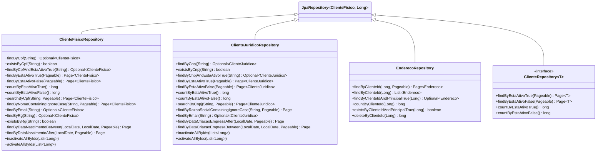
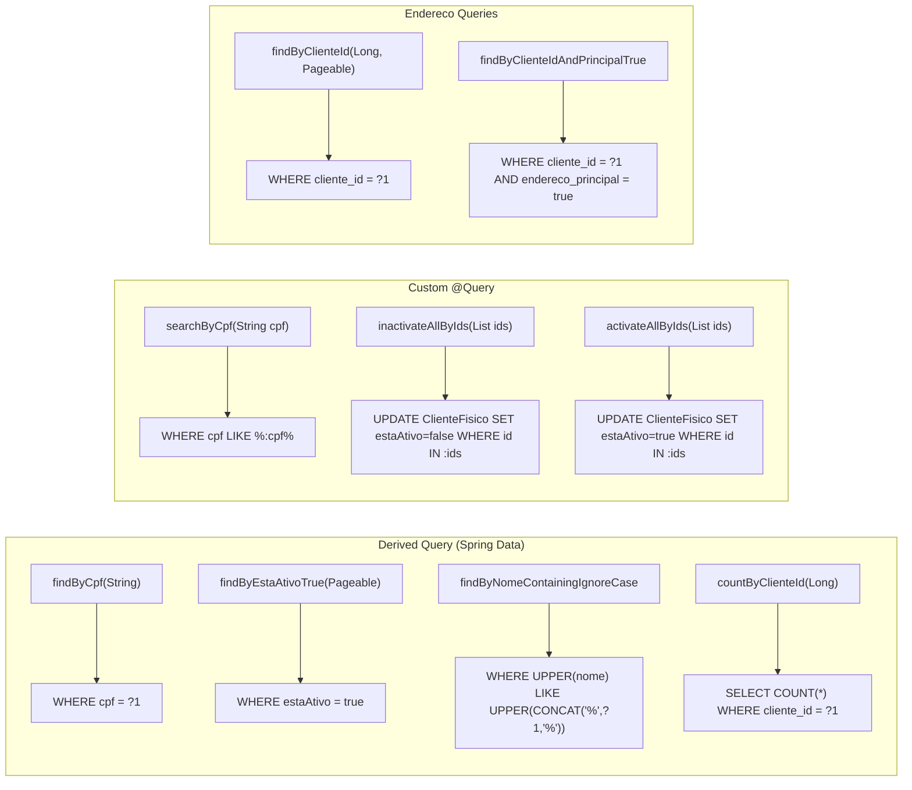
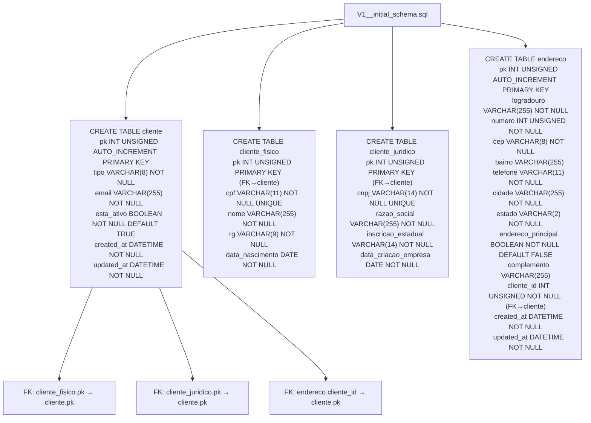

# Repositories e Flyway Migrations

## Camada de Repositórios



## Padrões de Query



## Módulo de Migrations

```
src/main/resources/db/migration/main/
└── V1__initial_schema.sql
```

## Estrutura do Schema (V1__initial_schema.sql)



## Relação: Repository → Service → Controller

```mermaid
flowchart TB
    subgraph "ClienteFisico Stack"
        CF_CTRL[ClienteFisicoController<br/>/v1/clientes/fisicos]
        CF_SRV[ClienteFisicoServiceImpl<br/>@Service @Transactional]
        CF_REPO[ClienteFisicoRepository<br/>@Repository]
        CF_REPO -->|extends| JPA1[JpaRepository~ClienteFisico, Long~]
        CF_CTRL --> CF_SRV
        CF_SRV --> CF_REPO
    end

    subgraph "ClienteJuridico Stack"
        CJ_CTRL[ClienteJuridicoController<br/>/v1/clientes/juridicos]
        CJ_SRV[ClienteJuridicoServiceImpl<br/>@Service @Transactional]
        CJ_REPO[ClienteJuridicoRepository<br/>@Repository]
        CJ_REPO -->|extends| JPA2[JpaRepository~ClienteJuridico, Long~]
        CJ_CTRL --> CJ_SRV
        CJ_SRV --> CJ_REPO
    end

    subgraph "Endereco Stack"
        E_CTRL[EnderecoController<br/>/v1/enderecos]
        E_SRV[EnderecoServiceImpl<br/>@Service @Transactional]
        E_REPO[EnderecoRepository<br/>@Repository]
        E_REPO -->|extends| JPA3[JpaRepository~Endereco, Long~]
        E_CTRL --> E_SRV
        E_SRV --> E_REPO
    end

    subgraph "Shared"
        CF_SRV --> E_SRV
        CJ_SRV --> E_SRV
    end
```

## Flyway — Como Adicionar Migrations

Para adicionar uma nova migration:

1. Crie o arquivo em `src/main/resources/db/migration/main/`
2. Nomeie como `V{numero}__{descricao}.sql` (e.g., `V2__add_telefone_celular.sql`)
3. Escreva o SQL da migration

```sql
-- V2__add_telefone_celular.sql
ALTER TABLE cliente ADD COLUMN telefone_celular VARCHAR(11) AFTER email;
```

> **Nota:** Nunca altere migrations já executadas em produção. Crie uma nova migration.
