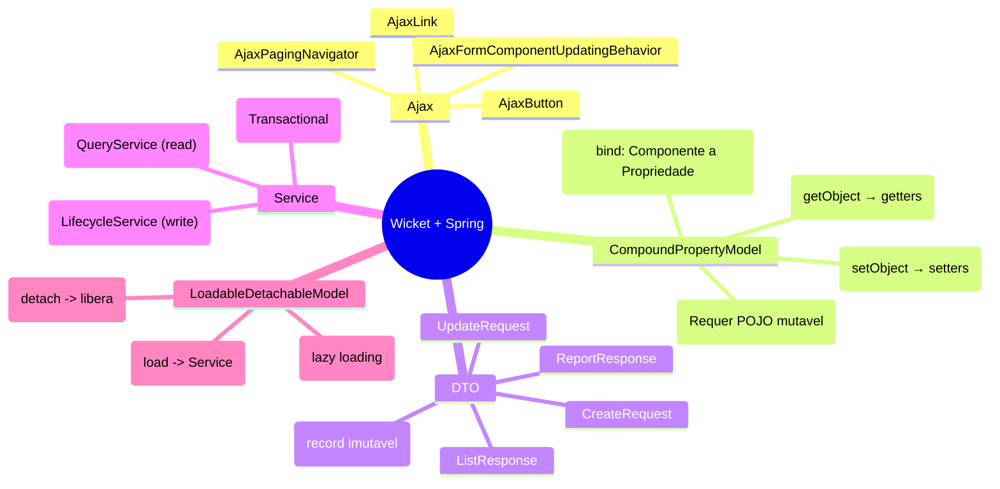
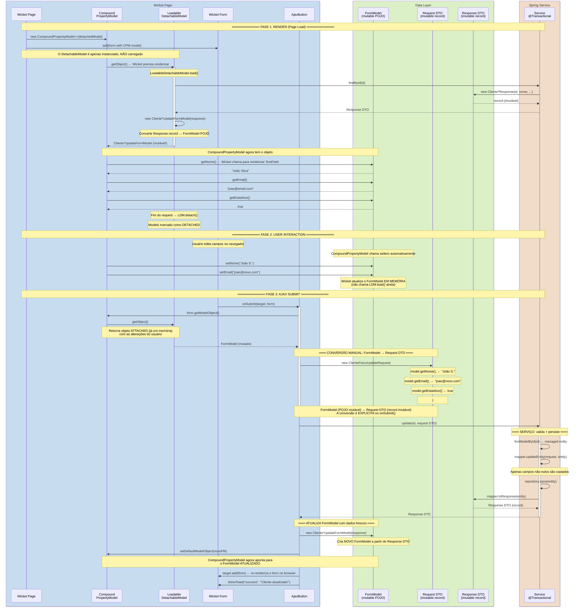
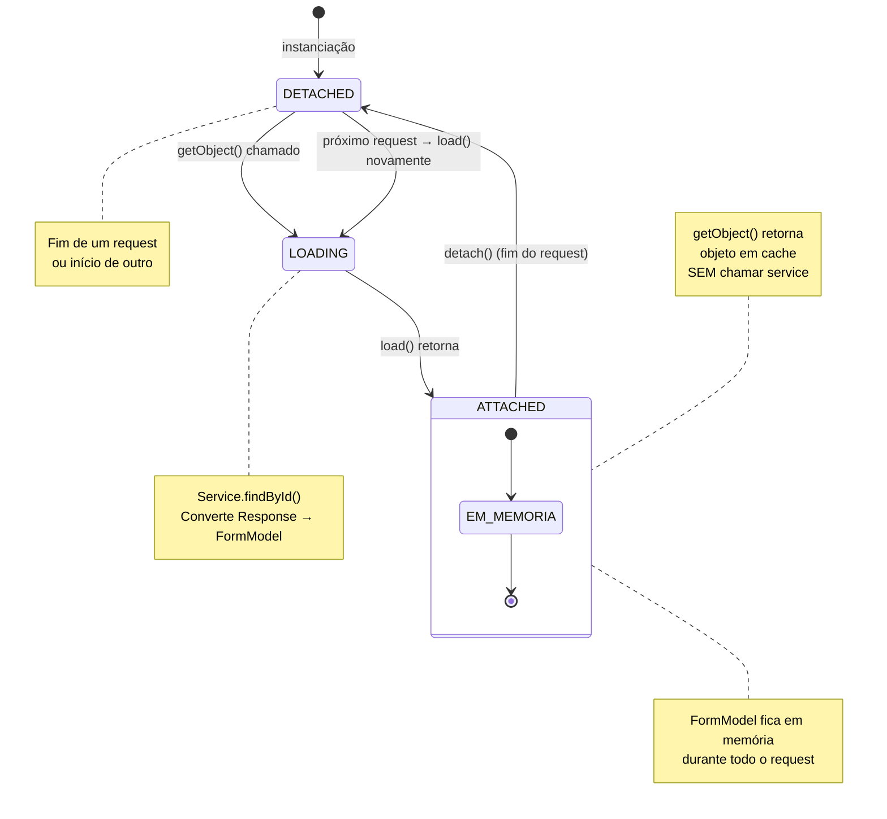
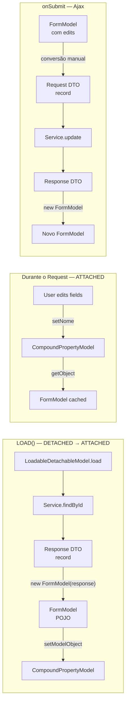

# Estudo: Ajax ↔ DTO ↔ Service ↔ CompoundPropertyModel ↔ DetachableModel

## Mapa Conceitual



## O Problema que estas 5 Peças Resolvem

```mermaid
flowchart LR
    subgraph "Browser"
        HTML[Formulário HTML]
        AJAX[Ajax Request]
    end

    subgraph "Wicket (Server)"
        CPM[CompoundPropertyModel<br/>bind automático<br/>nome → getNome/setNome]
        LDM[LoadableDetachableModel<br/>lazy-load entre requests<br/>detach após render]

        FM[FormModel<br/>POJO mutável<br/>serializável]
        DTO[DTO record<br/>imutável<br/>com validação]
    end

    subgraph "Spring"
        SRV[Service<br/>@Transactional<br/>regras de negócio]
        MAP[MapStruct Mapper<br/>Entity ↔ DTO]
    end

    subgraph "Database"
        DB[(MariaDB)]
    end

    HTML -->|submit| AJAX
    AJAX -->|onSubmit| CPM
    CPM -->|getObject| LDM
    LDM -->|load| SRV
    SRV -->|retorna| DTO
    DTO -->|constrói| FM
    CPM -->|bind| FM

    FM -->|manual convert| DTO
    DTO -->|create/update| SRV
    SRV -->|save| DB
```

## Diagrama Central: Lifecycle Completo (Render → Interação → Submit → Resposta)



## O Ciclo de Vida do LoadableDetachableModel



### Onde o DTO entra no ciclo?



## Por que a Separação FormModel ↔ DTO Existe?

```mermaid
flowchart LR
    subgraph "Wicket Precisa (CompoundPropertyModel)"
        CPMP[CompoundPropertyModel]
        CPMP -->|"chama"| GET[getNome()]
        CPMP -->|"chama"| SET[setNome("João")]
        GET -->|"precisa de"| GETTER[getter real<br/>não .nome()]
        SET -->|"precisa de"| SETTER[setter real<br/>não .nome = x]
    end

    subgraph "DTO record (imutável)"
        REC[record ClienteFisicoResponse]
        REC -.->|"❌"| GETTER
        REC -.->|"❌"| SETTER
        REC --> APENAS[.nome() accessor<br/>sem setter]
    end

    subgraph "FormModel POJO (mutável)"
        POJO[class ClienteFisicoUpdateFormModel]
        POJO -->|"✅"| GETTER
        POJO -->|"✅"| SETTER
        POJO --> PROP[propriedade editável]
    end

    DTO[DTO record] -.->|fonte de dados| FORM[FormModel]
    FORM -->|bind| CPM[CompoundPropertyModel<br/>funciona!]

    note[DTOs são para TRANSPORTE<br/>FormModels são para EDIÇÃO<br/>Wicket CompoundPropertyModel<br/>exige setters mutáveis]
```

## Mapa: Instância vs Tipo (exemplo ClienteFisico)

```mermaid
flowchart TB
    subgraph "1. Render"
        SRV1[Service.findById(1)]
        SRV1 -->|"retorna"| RESP1["ClienteFisicoResponse<br/>id=1, nome='João',<br/>cpf='123.456.789-01',<br/>email='joao@email.com',<br/>estaAtivo=true"]
        RESP1 -->|"constrói"| FM1["ClienteFisicoUpdateFormModel<br/>id=1, nome='João',<br/>cpf='123.456.789-01',<br/>email='joao@email.com',<br/>estaAtivo=true"]
        FM1 -->|"bind via CPM"| TXT1["TextField nome = 'João'"]
        FM1 -->|"bind via CPM"| TXT2["TextField email = 'joao@email.com'"]
    end

    subgraph "2. Edição"
        TXT1 -->|"usuário edita"| TXT1E["TextField nome = 'João S.'"]
        TXT2 -->|"usuário edita"| TXT2E["TextField email = 'joao@novo.com'"]
        TXT1E -->|"CPM.setNome()"| FM2["FormModel<br/>nome='João S.'"]
        TXT2E -->|"CPM.setEmail()"| FM2
    end

    subgraph "3. Submit Ajax"
        FM2 -->|"getModelObject()"| AJAXIN["AjaxButton.onSubmit"]
        AJAXIN -->|"converte"| UPDREQ["ClienteFisicoUpdateRequest<br/>nome='João S.'<br/>email='joao@novo.com'<br/>estaAtivo=true"]
        UPDREQ -->|"Service.update()"| SRV2[ClienteFisicoServiceImpl]
        SRV2 -->|"atualiza"| DB[(Database)]
        DB --> SRV2
        SRV2 -->|"retorna"| RESP2["Novo ClienteFisicoResponse<br/>nome='João S.',<br/>email='joao@novo.com'"]
        RESP2 -->|"novo FormModel"| FM3["Novo ClienteFisicoUpdateFormModel<br/>nome='João S.'<br/>email='joao@novo.com'"]
        FM3 -->|"CPM.setDefaultModelObject"| TXT1R["TextField re-renderizado"]
    end

    subgraph "4. Fim Request"
        FM3 -->|"LDM.detach()"| DET["LoadableDetachableModel<br/>→ DETACHED"]
        DET -->|"próximo request"| SRV1
    end
```

## Tabela Resumo: Responsabilidades

| Componente | Tipo | Mutável? | Função | Onde é criado |
|-----------|------|----------|--------|---------------|
| `LoadableDetachableModel` | abstract class | — | Lazy-load entre requests | `RowUpdateForm`, `AbstractClienteDataProvider` |
| `CompoundPropertyModel` | Wicket Model | — | Bind automático campo ↔ propriedade | `Form` constructor |
| `FormModel` | POJO | ✅ Sim | Adaptador para CPM | convertido de `Response DTO` |
| `Request DTO` | `record` | ❌ Não | Transporte de dados p/ service | convertido de `FormModel` no `onSubmit` |
| `Response DTO` | `record` | ❌ Não | Dados de saída do service | `Service.findById/update/create` |
| `Service` | `@Service` | — | Lógica de negócio + persistência | Spring container |
| `AjaxButton` | Wicket Behavior | — | Submissão assíncrona | `Form.add(new AjaxButton(...))` |

## Ordem dos Eventos (Render + Submit)

```mermaid
flowchart TD
    subgraph "RENDER (primeiro request)"
        R1[Page instancia Form] --> R2[CRIA LoadableDetachableModel]
        R2 --> R3[CRIA CompoundPropertyModel wrapping LDM]
        R3 --> R4[Wicket chama getObject]
        R4 --> R5[LDM.load → Service.findById → Response DTO]
        R5 --> R6[CONVERTE Response → FormModel]
        R6 --> R7[CPM bind: TextField → FormModel.getNome]
    end

    subgraph "AJAX SUBMIT"
        S1[Usuário clica AjaxButton] --> S2[CPM.getObject → LDM retorna FormModel cached]
        S2 --> S3[CONVERTE FormModel → Request DTO]
        S3 --> S4[Service.update(Request DTO)]
        S4 --> S5[Service retorna Response DTO]
        S5 --> S6[CONVERTE Response → Novo FormModel]
        S6 --> S7[CPM.setDefaultModelObject(novo FormModel)]
        S7 --> S8[target.add(form) → re-renderiza]
    end

    subgraph "DETACH (fim do request)"
        D1[LDM.detach] --> D2[Referência liberada]
        D2 --> D3[Próximo request: load novamente]
    end

    R7 --> S1
    S8 --> D1
```

## Padrão: O Fluxo Circular dos Dados

```
                 ┌─────────────────────────────────────────────────────┐
                 │                                                     │
                 │    Service (Spring)                                 │
                 │    ┌──────────────────────┐                        │
                 │    │  create/dto → Entity │                        │
                 │    │  Entity → Response   │                        │
                 │    └──────┬───────────────┘                        │
                 │           │                                        │
                 │           ▼                                        │
                 │    ┌──────────────────────┐                        │
                 │    │   Response DTO       │                        │
                 │    │   (record imutável)   │                        │
                 │    └──────┬───────────────┘                        │
                 │           │                                        │
                 │           ▼                                        │
    Ajax ──────► │    ┌──────────────────────┐                        │
    Button       │    │   FormModel (POJO)   │◄──── LoadableDetachable ────┐
    onSubmit     │    │   mutável para CPM   │       Model.load()     │    │
    │            │    └──────┬───────────────┘                        │    │
    │            │           │                                        │    │
    │            │           ▼                                        │    │
    │            │    ┌──────────────────────┐                        │    │
    └───────────────►│   Request DTO         │                        │    │
                     │   (record imutável)   │                        │    │
                     └──────┬───────────────┘                        │    │
                            │                                        │    │
                            ▼                                        │    │
                     ┌──────────────────────┐                       │    │
                     │   Service.create/    │───────────────────────┘    │
                     │   update(RequestDTO) │                            │
                     └──────────────────────┘                            │
                                                                         │
                    ┌────────────────────────────────────────────┐        │
                    │  LoadableDetachableModel lifecycle          │────────┘
                    │  DETACHED → LOAD (next request)             │
                    │          ↓                                 │
                    │  ATTACHED (durante request)                 │
                    │          ↓                                 │
                    │  DETACHED (fim do request)                  │
                    └────────────────────────────────────────────┘
```
