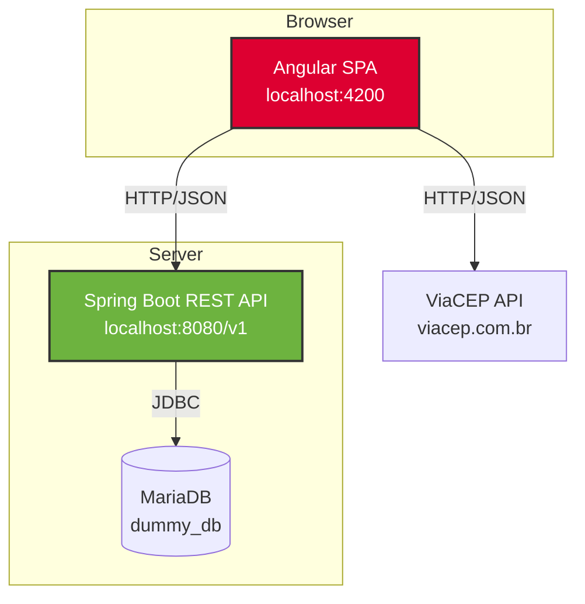
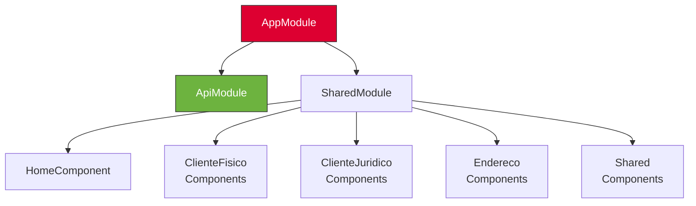
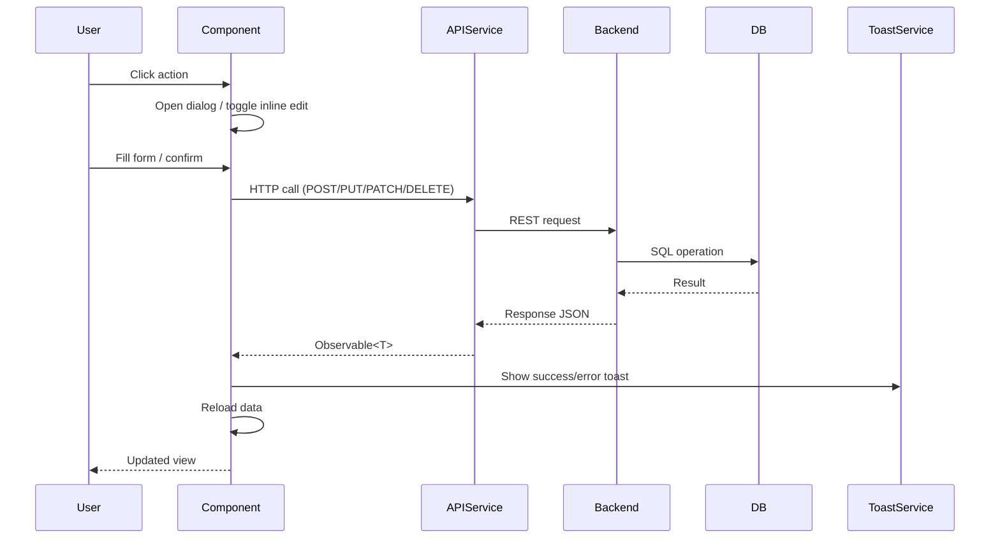
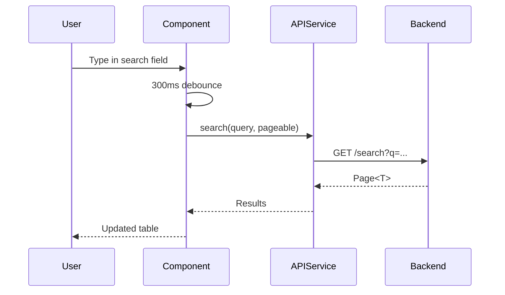
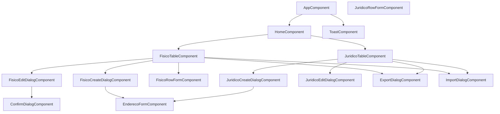
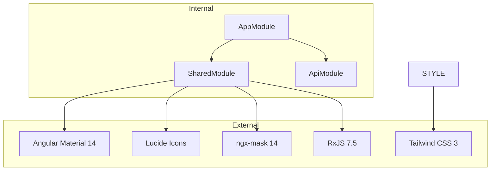
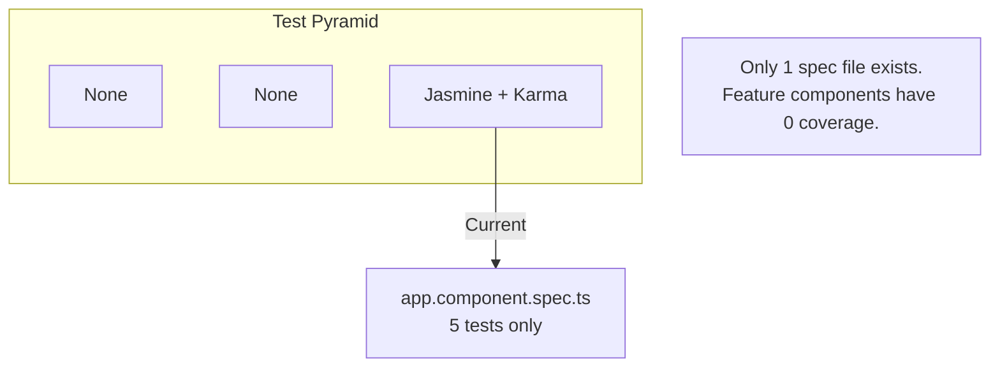

# Angular Frontend

## Executive Summary

Single-page application for client (PF/PJ) and address management. Built with Angular 14.2 and Angular Material, it consumes a Spring Boot REST API via an OpenAPI-generated client. Provides CRUD operations, fuzzy search, inline editing, PDF/XLSX export, XLSX import, and CEP auto-fill via ViaCEP.

## Architecture Diagrams

### System Context



### Module Dependency Graph



## Folder Structure

```
📁 angular/
├── 📁 src/
│   ├── 📁 app/
│   │   ├── 📁 api/                        # OpenAPI-generated client
│   │   │   ├── 📁 api/                    # REST service classes (6 files)
│   │   │   ├── 📁 model/                  # TS interfaces (~30 files)
│   │   │   ├── 📄 api.base.service.ts     # Base HTTP service
│   │   │   ├── 📄 api.module.ts           # Singleton ApiModule
│   │   │   └── 📄 configuration.ts        # API client config
│   │   ├── 📁 shared/                     # Reusable module
│   │   │   ├── 📁 components/             # 6 shared components
│   │   │   │   ├── 📁 confirm-dialog/     # Generic confirmation
│   │   │   │   ├── 📁 endereco-form/      # Multi-entry address FormArray
│   │   │   │   ├── 📁 endereco-list/      # Address display list
│   │   │   │   ├── 📁 export-dialog/      # PDF/XLSX export
│   │   │   │   ├── 📁 import-dialog/      # XLSX import
│   │   │   │   └── 📁 toast/              # Toast notifications
│   │   │   ├── 📁 services/               # ToastService, ViaCepService
│   │   │   ├── 📁 validators/             # CPF, CNPJ, CEP, phone validators
│   │   │   └── 📄 shared.module.ts
│   │   ├── 📁 home/                       # Dashboard with PF/PJ tabs
│   │   ├── 📁 cliente-fisico/             # PF components + detail page
│   │   ├── 📁 cliente-juridico/           # PJ components + detail page
│   │   └── 📁 endereco/                   # Address table + create dialog
│   ├── 📁 environments/                   # environment.ts, environment.prod.ts
│   └── 📁 templates/                      # Mustache templates for OpenAPI gen
├── 📄 package.json
├── 📄 angular.json
├── 📄 tailwind.config.js
├── 📄 proxy.conf.json
├── 📄 nx.json
├── 📄 openapitools.json
└── 📄 tsconfig.json
```

## Module Breakdown

### AppModule
| Responsibility | Key Details |
|---|---|
| Root module, bootstrap | `AppComponent` only in `declarations` |
| Imports | `BrowserModule`, `HttpClientModule`, `MatToolbarModule`, `AppRoutingModule`, `SharedModule`, `ApiModule.forRoot()` |
| Providers | `LOCALE_ID: 'pt-BR'` |
| Lazy loading | None — all components eagerly declared via SharedModule |

### SharedModule
| Responsibility | Key Details |
|---|---|
| Central declaration module | All feature + shared components declared here |
| Material imports | 14 modules: `MatCard`, `MatTable`, `MatPaginator`, `MatButton`, `MatDialog`, `MatSnackBar`, etc. |
| Exports | Material modules + shared components only (not feature components) |
| Third-party | `LucideAngularModule`, `NgxMaskModule.forRoot()` |

### ApiModule
| Responsibility | Key Details |
|---|---|
| OpenAPI client singleton | `forRoot()` guard prevents double import |
| Base path | Empty string (defaults to `http://localhost:8080`) |

## API Surface

### Generated API Services

All services extend `BaseService` and are `providedIn: 'root'`.

| Service | Base Path | Key Methods |
|---|---|---|
| `ClientesFisicosService` | `/v1/clientes/fisicos` | `getAll`, `getById`, `getByCpf`, `create`, `update`, `search`, `activate`, `inactivate`, `hardDelete`, `softDelete`, `getReport`, `existsByCpf` |
| `ClientesJuridicosService` | `/v1/clientes/juridicos` | `getAll`, `getById`, `getByCnpj`, `create`, `update`, `search`, `activate`, `inactivate`, `hardDelete`, `getReport`, `existsByCnpj` |
| `EnderecosService` | `/v1/enderecos` | `findAllByClienteId`, `create`, `createForCliente`, `update`, `delete`, `setAsPrincipal`, `search`, `countByClienteId`, `hasPrincipalAddress` |
| `ArquivoService` | `/v1/export` | PDF/XLSX export, XLSX import, template download |
| `MunicipiosService` | `/v1/municipios` | `findByUf` |
| `UnidadesFederativasService` | `/v1/unidades-federativas` | `findAll` |

### Frontend Routes

| Path | Component | Description |
|---|---|---|
| `""` | — | Redirects to `/home` |
| `home` | `HomeComponent` | Dashboard with PF/PJ tab switching |
| `fisico/:id` | `FisicoDetailComponent` | PF client detail page |
| `juridico/:id` | `JuridicoDetailComponent` | PJ client detail page |

## Data Flow

### CRUD Operation Flow



### Search Flow (Debounced)



## Component Tree

### Home Page



## Dependencies

### Module Dependency Graph



### External Dependencies Table

| Package | Version | Purpose |
|---|---|---|
| `@angular/core` | ^14.2.0 | Framework |
| `@angular/material` | ^14.2.7 | UI component library |
| `@angular/cdk` | ^14.2.7 | Component dev kit |
| `rxjs` | ~7.5.0 | Reactive programming |
| `lucide-angular` | 1.0.0 | Open-source icons |
| `ngx-mask` | ^14.3.3 | Input masking (CPF, CNPJ, CEP, phone) |
| `tailwindcss` | ^3.4.19 | Utility CSS |
| `zone.js` | ~0.11.4 | Angular change detection |
| `@openapitools/openapi-generator-cli` | ^2.34.0 | API client codegen |
| `mustache` | ^4.2.0 | Template engine for codegen |
| `nx` | 15.9.7 | Monorepo tooling |

## Configuration

### Environment Variables

| Variable | Source | Default | Description |
|---|---|---|---|
| `apiUrl` | `window.__env` | `http://localhost:8080` | Backend API base URL |
| `production` | `environment.ts` / `environment.prod.ts` | `false` | Production mode flag |

### Build Configuration

| Setting | Value |
|---|---|
| Build target | ES2020 |
| Module | ES2020 |
| Strict mode | Enabled |
| Strict templates | Enabled |
| Style | SCSS |
| Package manager | pnpm |
| Output hashing | Production only |
| Budget (initial) | 2MB warning, 3MB error |

### Proxy Config (Development)

```json
{ "/v1": { "target": "http://localhost:8080", "secure": false } }
```

## Testing Strategy



**Framework:** Jasmine 4.3 + Karma 6.4  
**Runner:** Chrome (headless)  
**Coverage:** `./coverage/ng14-workspace`  
**Command:** `ng test`

## Troubleshooting

| Problem | Likely Cause | Solution |
|---|---|---|
| API calls fail with 404 | Backend not running | Start `docker-compose up mariadb` + backend |
| CORS errors | Backend not allowing origin | Check `WebConfig` allows `localhost:4200` |
| OpenAPI client outdated | Backend spec changed | Run `npm run generate:api` |
| Input masks not working | ngx-mask not configured | Ensure `NgxMaskModule.forRoot()` imported |
| Proxy not working | `proxy.conf.json` misconfigured | Check target matches backend port |

## Related Documents

- [[Spring Backend]] — REST API consumed by this frontend
- [[Wicket UI]] — Alternative UI layer for same backend
- [[Flyway Migrations]] — Database schema reference
