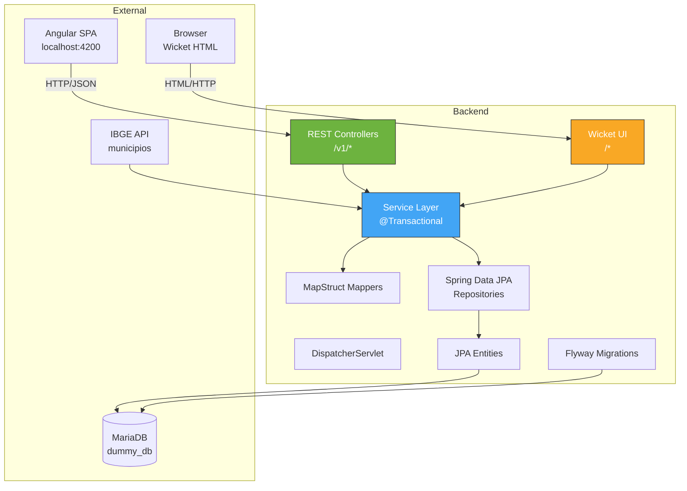
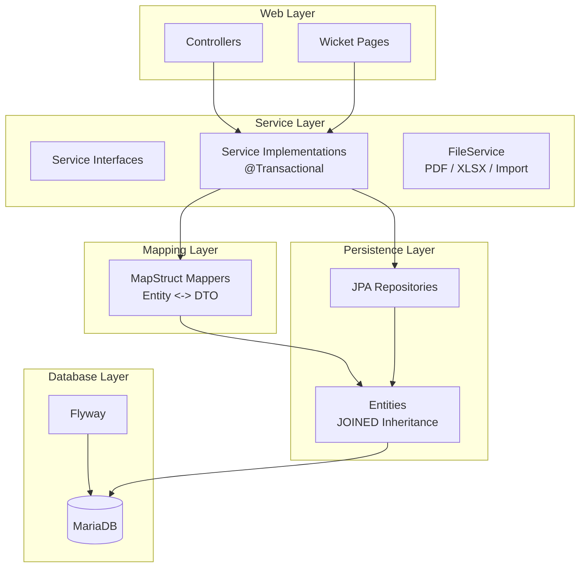
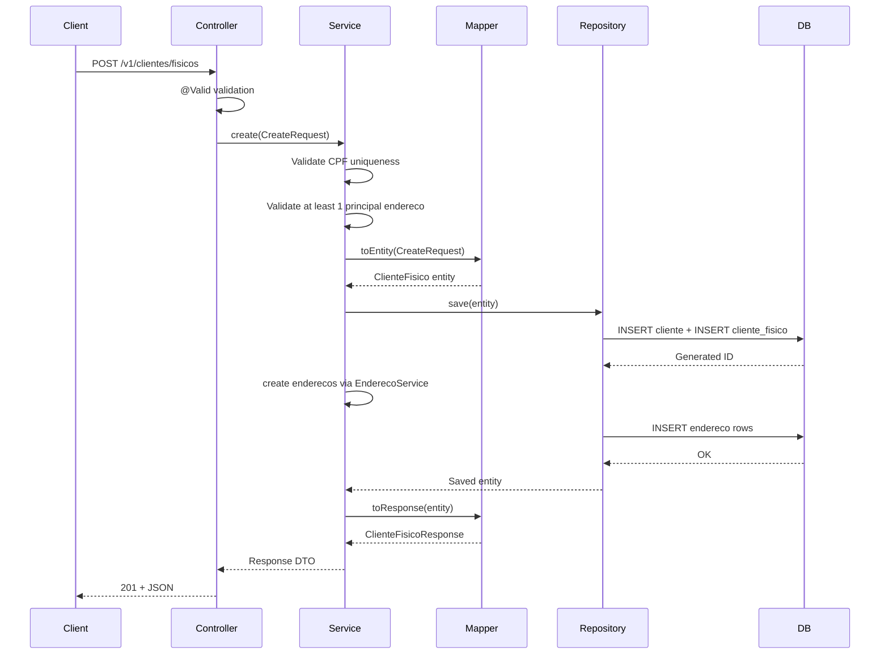
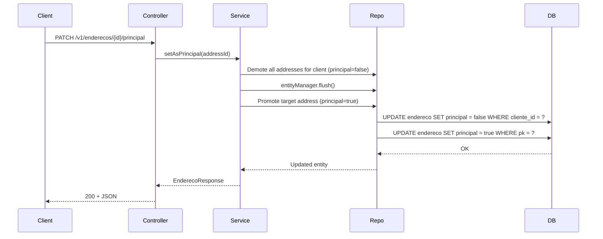
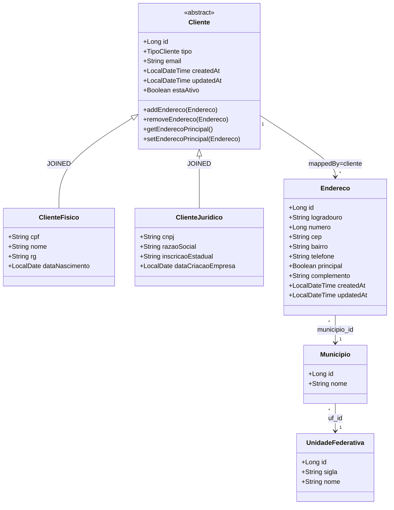
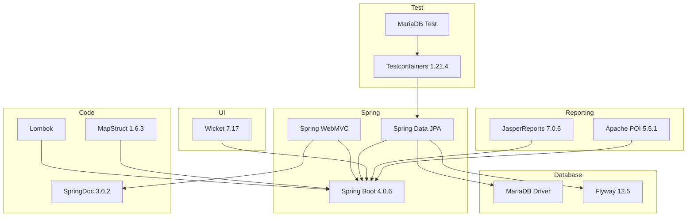
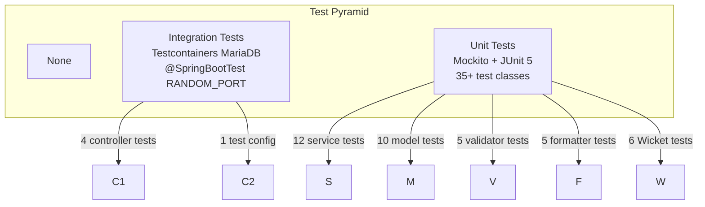

# Spring Backend

## Executive Summary

REST API for client (PF/PJ) and address management with JasperReports PDF generation, Apache POI XLSX import/export, and fuzzy search. Uses JOINED inheritance for client types (ClienteFisico, ClienteJuridico), Flyway for schema migrations, and MapStruct for DTO mapping. Includes a Wicket-based UI layer alongside the REST controllers.

## Architecture Diagrams

### System Context



### Layered Architecture



## Folder Structure

```
📁 spring/estagio/src/main/java/com/desafio/estagio/
├── 📄 EstagioApplication.java                         # Main class
├── 📁 config/
│   ├── 📄 WebConfig.java                              # CORS configuration
│   ├── 📄 WicketConfig.java                           # WicketFilter registration
│   ├── 📄 JasperReportsConfig.java                    # .jrxml compilation
│   └── 📄 OpenApiCustomizerConfig.java                # OpenAPI operationId normalization
├── 📁 controller/                                      # 6 REST controllers
│   ├── 📄 ClienteFisicoController.java                # /v1/clientes/fisicos
│   ├── 📄 ClienteJuridicoController.java              # /v1/clientes/juridicos
│   ├── 📄 EnderecoController.java                     # /v1/enderecos
│   ├── 📄 FileController.java                         # /v1/export (PDF/XLSX/import)
│   ├── 📄 MunicipioController.java                    # /v1/municipios
│   └── 📄 UnidadeFederativaController.java            # /v1/unidades-federativas
├── 📁 mapper/                                          # 3 MapStruct mappers
│   ├── 📄 ClienteFisicoMapper.java
│   ├── 📄 ClienteJuridicoMapper.java
│   └── 📄 EnderecoMapper.java
├── 📁 dto/                                             # Immutable records
│   ├── 📁 clientefisico/                               # 5 DTOs (create, update, response, list, report)
│   ├── 📁 clientejuridico/                             # 5 DTOs
│   ├── 📁 endereco/                                    # 7 DTOs + sanitizers
│   ├── 📁 unidadefederativa/                           # 1 DTO
│   └── 📁 municipio/                                   # 1 DTO
├── 📁 model/                                           # 6 JPA entities
│   ├── 📄 Cliente.java                                 # Abstract base (JOINED inheritance)
│   ├── 📄 ClienteFisico.java                           # PF client
│   ├── 📄 ClienteJuridico.java                         # PJ client
│   ├── 📄 Endereco.java                                # Address entity
│   ├── 📄 UnidadeFederativa.java                       # Brazilian state
│   ├── 📄 Municipio.java                               # City/town
│   ├── 📁 enums/
│   │   └── 📄 TipoCliente.java                         # FISICA, JURIDICA
│   └── 📁 formatter/                                   # 5 formatters (CPF, CNPJ, CEP, RG, phone)
├── 📁 repository/                                      # 6 JPA repositories
│   ├── 📄 ClienteRepository.java
│   ├── 📄 ClienteFisicoRepository.java
│   ├── 📄 ClienteJuridicoRepository.java
│   ├── 📄 EnderecoRepository.java
│   ├── 📄 UnidadeFederativaRepository.java
│   └── 📄 MunicipioRepository.java
├── 📁 service/
│   ├── 📄 AbstractClienteService.java                  # Base (final activate/inactivate)
│   ├── 📄 ClienteFisicoService.java                    # Query + Lifecycle composed
│   ├── 📄 ClienteJuridicoService.java
│   ├── 📄 EnderecoService.java                         # Interface
│   ├── 📄 FileService.java                             # Interface
│   ├── 📄 JasperReportService.java                     # Interface
│   ├── 📄 IbgeService.java                             # IBGE API auto-populate
│   ├── 📁 impl/                                        # 6 implementations
│   │   ├── 📄 ClienteFisicoServiceImpl.java
│   │   ├── 📄 ClienteJuridicoServiceImpl.java
│   │   ├── 📄 EnderecoServiceImpl.java
│   │   ├── 📄 JasperReportServiceImpl.java
│   │   ├── 📄 PdfFileServiceImpl.java
│   │   └── 📄 XlsxFileServiceImpl.java
│   ├── 📁 query/                                       # Read-only interfaces
│   └── 📁 lifecycle/                                   # Write interfaces
├── 📁 validation/
│   ├── 📄 ValidationConstants.java                     # Centralized field limits
│   ├── 📁 annotation/                                  # 5 custom annotations
│   └── 📁 internal/                                    # 5 validators
├── 📁 exceptions/
│   ├── 📄 ResourceNotFoundException.java               # 404
│   ├── 📄 BusinessException.java                       # 422
│   ├── 📄 ConflictException.java                       # 409
│   └── 📁 handlers/
│       ├── 📄 GlobalExceptionHandler.java              # @RestControllerAdvice
│       └── 📄 APIErrorResponse.java                    # Error response builder
├── 📁 factory/                                         # Entity factories
│   ├── 📄 ClienteFactory.java
│   ├── 📄 ClienteFactoryImpl.java
│   ├── 📄 EnderecoFactory.java
│   └── 📄 EnderecoFactoryImpl.java
└── 📁 wicket/                                          # Wicket UI layer (detailed in [[Wicket UI]])
```

## Module Breakdown

### Controllers Layer
| Controller | Base Path | Responsibility |
|---|---|---|
| `ClienteFisicoController` | `/v1/clientes/fisicos` | PF CRUD, search, activate/inactivate, hard/soft delete, report |
| `ClienteJuridicoController` | `/v1/clientes/juridicos` | PJ CRUD, search, activate/inactivate, hard delete, report |
| `EnderecoController` | `/v1/enderecos` | Address CRUD, principal management, fuzzy search, count checks |
| `FileController` | `/v1/export` | PDF/XLSX export, XLSX import, template download |
| `MunicipioController` | `/v1/municipios` | List/filter by UF |
| `UnidadeFederativaController` | `/v1/unidades-federativas` | List all states |

### Service Layer
| Service | Key Methods | Transactional |
|---|---|---|
| `ClienteFisicoServiceImpl` | `create`, `update`, `findById`, `search`, `activate`, `inactivate`, `hardDelete` | Yes |
| `ClienteJuridicoServiceImpl` | `create`, `update`, `findById`, `search`, `activate`, `inactivate`, `hardDelete` | Yes |
| `EnderecoServiceImpl` | `create`, `update`, `setAsPrincipal`, `delete`, `search`, `searchByClienteId` | Yes |
| `JasperReportServiceImpl` | `generateReport`, typed/paginated/streaming report generation | Yes |
| `PdfFileServiceImpl` | `pdfFisicos`, `pdfJuridicos`, `pdfEnderecos` | Yes |
| `XlsxFileServiceImpl` | `xlsxFisicos`, `xlsxJuridicos`, `xlsxEnderecos`, `import*`, `template*` | Yes |
| `IbgeService` | `init()` (auto-populate municipios from IBGE API) | No |

### Entity Layer
| Entity | Table | Inheritance | Key Fields |
|---|---|---|---|
| `Cliente` (abstract) | `cliente` | Base (JOINED) | `id`, `tipo`, `email`, `createdAt`, `updatedAt`, `estaAtivo`, `enderecos` |
| `ClienteFisico` | `cliente_fisico` | Extends Cliente | `cpf` (unique), `nome`, `rg`, `dataNascimento` |
| `ClienteJuridico` | `cliente_juridico` | Extends Cliente | `cnpj` (unique), `razaoSocial`, `inscricaoEstadual`, `dataCriacaoEmpresa` |
| `Endereco` | `endereco` | Independent | `logradouro`, `numero`, `cep`, `bairro`, `telefone`, `municipio` (M:1), `principal`, `cliente` (M:1) |
| `UnidadeFederativa` | `unidade_federativa` | Reference | `id`, `sigla` (unique), `nome` |
| `Municipio` | `municipio` | Reference | `id`, `nome`, `unidadeFederativa` (M:1) |

## API Surface

### Cliente Fisico — `/v1/clientes/fisicos`

| Method | Path | Params | Returns | Description |
|---|---|---|---|---|
| GET | `/` | `Pageable` | `Page<ClienteFisicoListResponse>` | Paginated list, sorted by ID ASC |
| GET | `/search` | `q`, `Pageable` | `Page<ClienteFisicoListResponse>` | Fuzzy search |
| GET | `/ativos` | `Pageable` | `Page<ClienteFisicoListResponse>` | Active only |
| GET | `/{id}` | `id` | `ClienteFisicoResponse` | By ID |
| GET | `/cpf/{cpf}` | `cpf` | `ClienteFisicoResponse` | By CPF |
| GET | `/cpf/{cpf}/exists` | `cpf` | `Boolean` | CPF existence check |
| POST | `/` | `@Valid CreateRequest` | `ClienteFisicoResponse` (201) | Create |
| PUT | `/{id}` | `@Valid UpdateRequest` | `ClienteFisicoResponse` | Partial update |
| PATCH | `/{id}/ativar` | `id` | 204 | Activate |
| PATCH | `/{id}/inativar` | `id` | 204 | Inactivate (soft delete) |
| DELETE | `/{id}` | `id` | 204 | Soft delete |
| DELETE | `/{id}/permanent` | `id` | 204 | Hard delete |
| GET | `/relatorio` | `Pageable` | `Page<ClienteFisicoReportResponse>` | Report data |

### Cliente Juridico — `/v1/clientes/juridicos`

| Method | Path | Returns | Description |
|---|---|---|---|
| GET | `/` | `Page<ClienteJuridicoListResponse>` | Paginated list |
| GET | `/search` | `Page<ClienteJuridicoListResponse>` | Fuzzy search |
| GET | `/ativos` | `Page<ClienteJuridicoListResponse>` | Active only |
| GET | `/{id}` | `ClienteJuridicoResponse` | By ID |
| GET | `/cnpj/{cnpj}` | `ClienteJuridicoResponse` | By CNPJ |
| GET | `/cnpj/{cnpj}/exists` | `Boolean` | CNPJ check |
| POST | `/` | `ClienteJuridicoResponse` (201) | Create |
| PUT | `/{id}` | `ClienteJuridicoResponse` | Update |
| PATCH | `/{id}/ativar` | 204 | Activate |
| PATCH | `/{id}/inativar` | 204 | Inactivate |
| DELETE | `/{id}` | 204 | Hard delete |
| GET | `/relatorio` | `Page<ClienteJuridicoReportResponse>` | Report data |

### Enderecos — `/v1/enderecos`

| Method | Path | Returns | Description |
|---|---|---|---|
| POST | `/` | `EnderecoResponse` (201) | Create |
| POST | `/clientes/{clienteId}` | `EnderecoResponse` (201) | Create for client |
| GET | `/{id}` | `EnderecoResponse` | By ID |
| GET | `/clientes/{clienteId}` | `Page<EnderecoListResponse>` | By client (paginated) |
| GET | `/clientes/{clienteId}/principal` | `EnderecoResponse` | Principal address |
| GET | `/clientes/{clienteId}/count` | `Long` | Address count |
| PUT | `/{id}` | `EnderecoResponse` | Update |
| PATCH | `/{id}/principal` | `EnderecoResponse` | Set as principal |
| DELETE | `/{id}` | 204 | Delete |
| DELETE | `/clientes/{clienteId}` | 204 | Delete all for client |
| GET | `/search` | `Page<EnderecoListResponse>` | Global fuzzy search |
| GET | `/clientes/{clienteId}/search` | `Page<EnderecoListResponse>` | Scoped fuzzy search |
| GET | `/clientes/{clienteId}/has-addresses` | `Boolean` | Has addresses check |
| GET | `/clientes/{clienteId}/has-principal` | `Boolean` | Has principal check |

### Export/Import — `/v1/export`

| Method | Path | Returns | Description |
|---|---|---|---|
| GET | `/clientes/fisicos/pdf` | PDF bytes | PF client report |
| GET | `/clientes/juridicos/pdf` | PDF bytes | PJ client report |
| GET | `/clientes/{clienteId}/enderecos/pdf` | PDF bytes | Address report |
| GET | `/clientes/fisicos/xlsx` | XLSX bytes | XLSX export |
| GET | `/clientes/juridicos/xlsx` | XLSX bytes | XLSX export |
| GET | `/clientes/{clienteId}/enderecos/xlsx` | XLSX bytes | XLSX export |
| GET | `/clientes/fisicos/template` | XLSX bytes | Import template download |
| GET | `/clientes/juridicos/template` | XLSX bytes | Import template download |
| GET | `/enderecos/template` | XLSX bytes | Import template download |
| POST | `/clientes/fisicos/import` | `ImportResult` | XLSX import (multipart) |
| POST | `/clientes/juridicos/import` | `ImportResult` | XLSX import |
| POST | `/enderecos/import` | `ImportResult` | XLSX import (+ clienteId) |

### Reference Data

| Controller | Path | Returns | Description |
|---|---|---|---|
| `MunicipioController` | `GET /v1/municipios?ufSigla=` | `List<MunicipioDTO>` | Filtered by UF |
| `UnidadeFederativaController` | `GET /v1/unidades-federativas` | `List<UnidadeFederativaDTO>` | All states |

## Data Flow

### Create ClienteFisico Flow



### Set Principal Address Flow



## Entity Relationship Diagram



## Dependencies



### External Dependencies Table

| Group/Artifact | Version | Purpose |
|---|---|---|
| `spring-boot-starter-webmvc` | 4.0.6 | REST framework |
| `spring-boot-starter-data-jpa` | 4.0.6 | JPA/Hibernate |
| `springdoc-openapi-starter-webmvc-ui` | 3.0.2 | OpenAPI docs |
| `wicket-core` | 7.17.0 | Wicket UI framework |
| `flyway-core` / `flyway-mysql` | 12.5.0 | Schema migrations |
| `mysql-connector-j` | 9.7.0 | MariaDB/MySQL driver |
| `mapstruct` | 1.6.3 | DTO mapping |
| `jasperreports` / `jasperreports-pdf` | 7.0.6 | PDF generation |
| `poi` / `poi-ooxml` | 5.5.1 | XLSX import/export |
| `testcontainers` / `testcontainers-mariadb` | 1.21.4 | Integration tests |
| `lombok` | — | Boilerplate reduction |

## Configuration

### Application Properties

| Property | Value |
|---|---|
| `spring.datasource.url` | `jdbc:mysql://localhost:3306/dummy_db` |
| `spring.datasource.username` | `root` |
| `spring.datasource.password` | `mariadb` |
| `spring.jpa.hibernate.ddl-auto` | `validate` |
| `spring.jpa.show-sql` | `true` |
| `spring.jpa.properties.hibernate.dialect` | `MariaDBDialect` |
| `spring.flyway.enabled` | `true` |
| `spring.flyway.locations` | `classpath:db/migration/main` |
| `springdoc.use-fqn` | `true` |

### Test Properties

| Property | Value |
|---|---|
| `spring.jpa.hibernate.ddl-auto` | `update` |
| `spring.flyway.enabled` | `false` |
| `spring.test.database.replace` | `none` |

### CORS Configuration

| Setting | Value |
|---|---|
| Allowed origin | `http://localhost:4200` |
| Allowed paths | `/v1/**` |
| Methods | GET, POST, PUT, DELETE, OPTIONS |
| Credentials | `true` |

### Build Configuration

| Setting | Value |
|---|---|
| Java version | 17 |
| WAR name | `estagio-1.0-SNAPSHOT.war` |
| Package | WAR (deployable to external container) |
| JVM args | `--add-opens java.base/java.lang=ALL-UNNAMED` + `java.base/java.lang.reflect=ALL-UNNAMED` |

## Flyway Migrations

| Migration | Description |
|---|---|
| `V1__ClienteEntity.sql` | Create `cliente` table (pk, tipo, email, created_at, updated_at, ativo) |
| `V2__ClienteFisicoEntity.sql` | Create `cliente_fisico` with CHECK constraints |
| `V3__ClienteJuridicoEntity.sql` | Create `cliente_juridico` with CHECK constraints |
| `V4__EnderecoEntity.sql` | Create `endereco` with computed column for unique principal index |
| `V5__AlterRgConstraint.sql` | Relax RG length constraint (7-9 instead of 8-9) |
| `V6__AlterEnderecoTelefoneNullable.sql` | Make telefone nullable |
| `V7__CreateUnidadeFederativaTable.sql` | Create UF table + insert 27 Brazilian states |
| `V8__CreateMunicipioTable.sql` | Create municipio table (populated by IbgeService) |
| `V9__AddMunicipioForeignKeyToEndereco.sql` | Add municipio_id FK, migrate data, drop cidade/estado |

## Testing Strategy



**Framework:** JUnit 5 + Mockito  
**Integration:** Testcontainers with MariaDB, Hibernate DDL update  
**Wicket:** Component/page rendering tests  
**Command:** `rtk gradlew test`  
**Coverage:** `build/reports/tests/test/`

## Troubleshooting

| Problem | Likely Cause | Solution |
|---|---|---|
| `ddl-auto=validate` fails | Flyway not run | Run Flyway migration or set to `update` |
| Port 8080 in use | Another process | `lsof -ti:8080 \| xargs kill` |
| IBGE init timeout | No internet | Can run without municipios, populate manually |
| Wicket pages render blank | Template not alongside Java | Verify `.html` is in same directory as `.java` |
| Duplicate key on setAsPrincipal | Flush missing | Uses `flush()` between demote and promote |
| `--add-opens` errors | JVM version mismatch | Ensure Gradle applies JVM args to all tasks |

## Related Documents

- [[Angular Frontend]] — SPA consuming this API
- [[Wicket UI]] — Wicket-based alternative UI
- [[Flyway Migrations]] — Detailed migration descriptions
