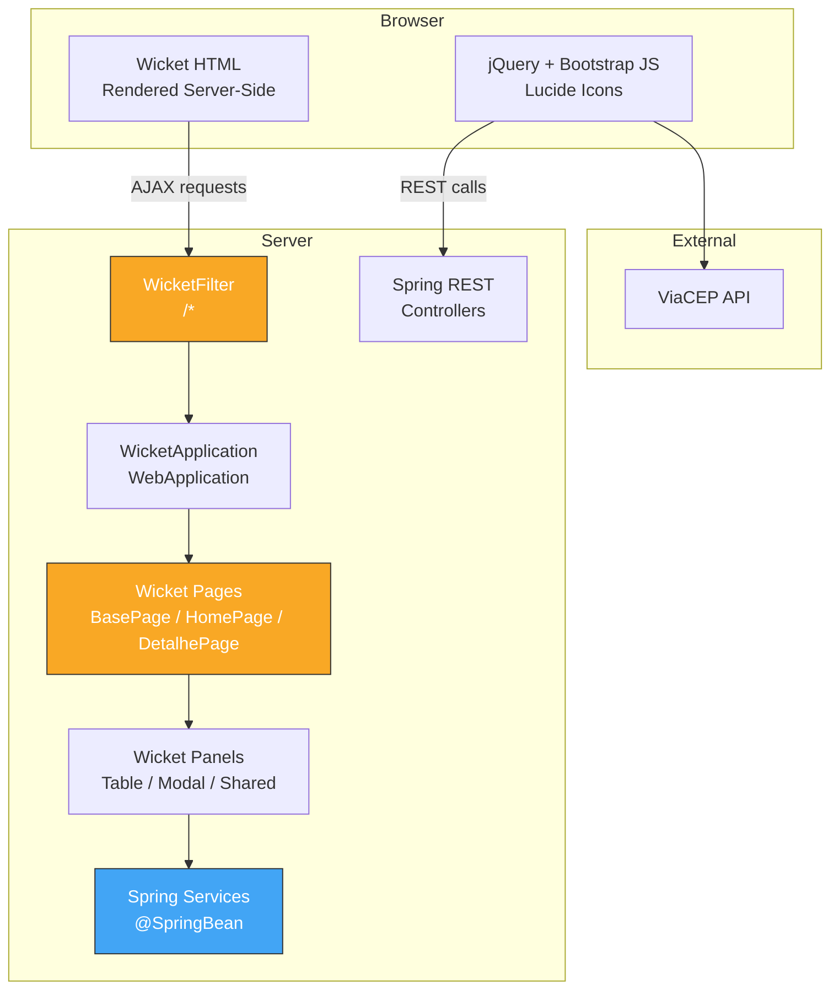
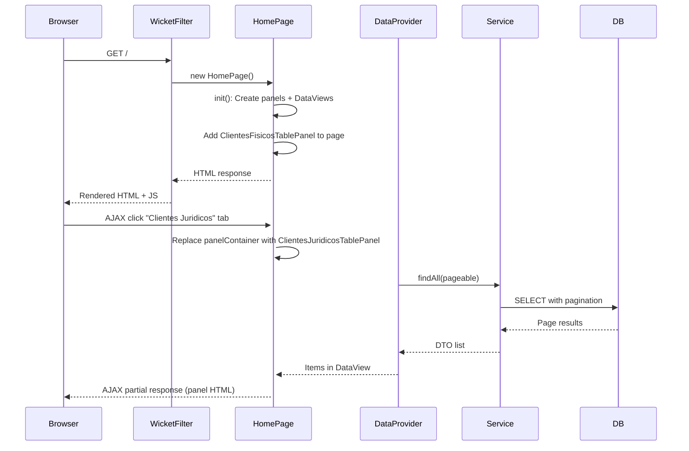
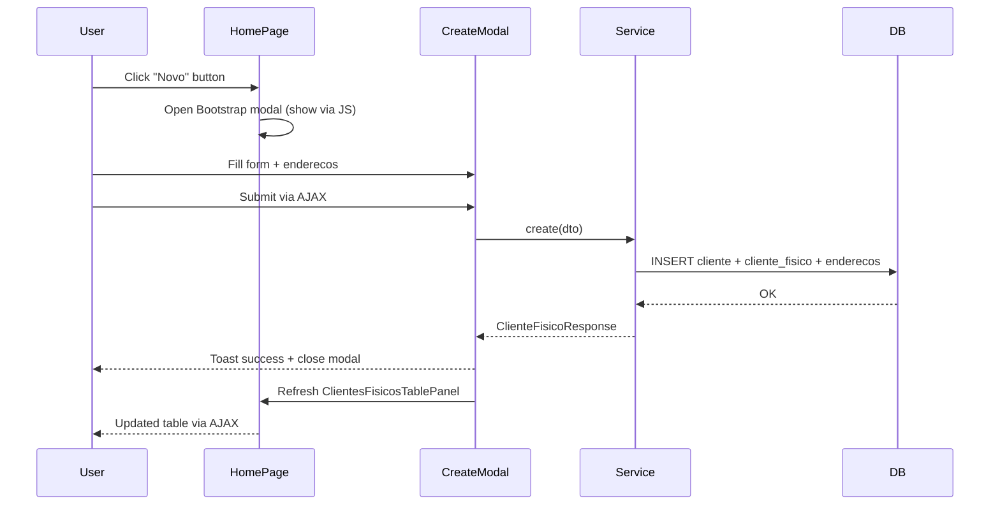
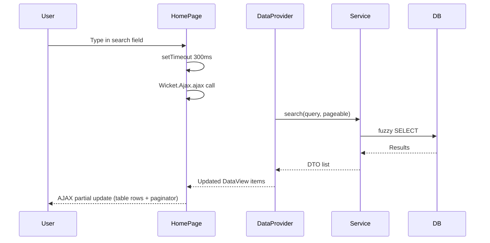
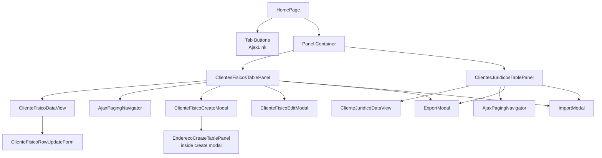
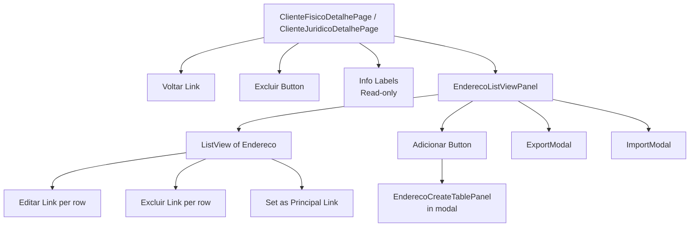
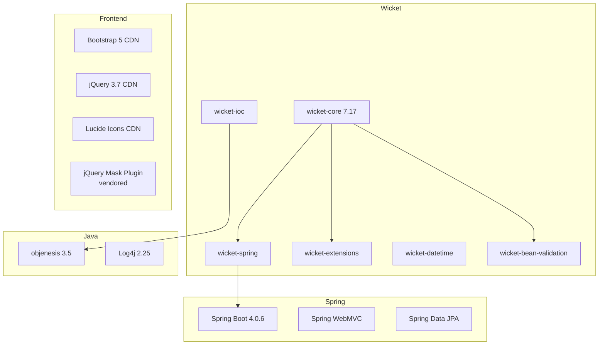
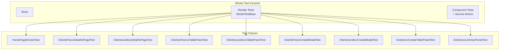

# Wicket UI

## Executive Summary

Server-side rendered UI layer built on Apache Wicket 7.17, providing the same CRUD functionality as the Angular SPA but without JavaScript frameworks. Uses Bootstrap 5 modals, AJAX behaviors for partial page updates, jQuery Mask Plugin for input formatting, and ViaCEP for address autofill. Templates live alongside Java files (Wicket convention).

## Architecture Diagrams

### System Context



### Page Hierarchy

```mermaid
graph TB
    subgraph Wicket
        WP[WebPage<br/>Wicket Core]
        BP[BasePage<br/>abstract<br/>Layout + Navbar + Footer]
        HP[HomePage<br/>Mount: /<br/>PF/PJ Tabbed Tables]
        CFDP[ClienteFisicoDetalhePage<br/>Mount: /clientes/detalhe/${id}]
        CJDP[ClienteJuridicoDetalhePage<br/>Not mounted<br/>BookmarkablePageLink only]
    end

    WP --> BP
    BP --> HP
    BP --> CFDP
    BP --> CJDP
```

## Folder Structure

```
📁 wicket/
├── 📁 application/
│   └── 📄 WicketApplication.java                        # WebApplication setup + mounts
├── 📁 builder/
│   ├── 📄 FormFieldBuilder.java                         # Fluent TextField builder
│   ├── 📄 FormFieldBundle.java                          # (field + feedbackLabel) record
│   ├── 📄 ComponentAttributeBuilder.java                # Fluent component configurator
│   └── 📄 AttributeModifierBuilder.java                 # AttributeModifier factory
├── 📁 component/
│   ├── 📄 ValidationFeedback.java                       # Feedback label + toast utilities
│   ├── 📁 dataview/
│   │   ├── 📄 AbstractClienteDataView.java              # Abstract DataView<T>
│   │   └── 📄 ClienteFisicoDataView.java / ClienteJuridicoDataView.java
│   ├── 📁 form/
│   │   ├── 📄 ClienteFisicoRowUpdateForm.java           # Inline row edit form (tag-switched)
│   │   └── 📄 ClienteJuridicoRowUpdateForm.java
│   ├── 📁 modal/
│   │   ├── 📄 ClienteFisicoCreateModal.java             # + .html
│   │   ├── 📄 ClienteFisicoEditModal.java               # + .html
│   │   ├── 📄 ClienteJuridicoCreateModal.java           # + .html
│   │   ├── 📄 ClienteJuridicoEditModal.java             # + .html
│   │   ├── 📄 ExportModal.java                          # + .html
│   │   └── 📄 ImportModal.java                          # + .html
│   ├── 📁 shared/
│   │   ├── 📄 EnderecoCreateTablePanel.java             # + .html
│   │   ├── 📄 EnderecoListViewPanel.java                # + .html
│   │   └── 📄 EnderecoFileOperations.java               # File utility methods
│   └── 📁 table/
│       ├── 📄 ClientesTablePanel.java                   # Abstract template method
│       ├── 📄 ClientesFisicosTablePanel.java            # + .html
│       └── 📄 ClientesJuridicosTablePanel.java          # + .html
├── 📁 mapper/
│   ├── 📄 ClienteFisicoDtoMapper.java                   # FormModel <-> DTO
│   ├── 📄 ClienteJuridicoDtoMapper.java
│   └── 📄 EnderecoDtoMapper.java
├── 📁 model/
│   ├── 📄 ClienteCreateFormModel.java                   # Abstract base
│   ├── 📄 ClienteFisicoCreateFormModel.java
│   ├── 📄 ClienteFisicoUpdateFormModel.java
│   ├── 📄 ClienteJuridicoCreateFormModel.java
│   ├── 📄 ClienteJuridicoUpdateFormModel.java
│   └── 📄 EnderecoCreateFormModel.java
├── 📁 page/
│   ├── 📁 base/
│   │   ├── 📄 BasePage.java                             # + .html (layout shell)
│   ├── 📁 clientes/
│   │   ├── 📄 ClienteFisicoDetalhePage.java              # + .html
│   │   └── 📄 ClienteJuridicoDetalhePage.java            # + .html
│   └── 📁 home/
│       └── 📄 HomePage.java                              # + .html
├── 📁 provider/
│   ├── 📄 AbstractClienteDataProvider.java               # Abstract SortableDataProvider
│   ├── 📄 ClienteFisicoDataProvider.java
│   └── 📄 ClienteJuridicoDataProvider.java
└── 📁 util/
    ├── 📄 ByteArrayResourceStream.java                   # File download stream
    ├── 📄 ErrorHandler.java                              # Service call wrapper
    └── 📄 JavaScriptUtils.java                            # JS execution helpers

📁 src/main/resources/com/desafio/estagio/wicket/util/js/
├── 📄 home-tabs.js                                       # Active tab highlighting
├── 📄 mask-init.js                                       # jQuery Mask Plugin init
├── 📄 viacep.js                                           # CEP autocomplete
├── 📄 endereco-modal.js                                   # Bootstrap modal show/hide
└── 📄 jquery.mask.min.js                                  # Vendored mask plugin
```

## Module Breakdown

### Pages Layer

| Page | Mount | Description | Key Components |
|---|---|---|---|
| `BasePage` | — (abstract) | Layout shell with dark navbar, footer, `<wicket:child/>` | Navbar, footer, debug bar |
| `HomePage` | `/` | Dashboard with two tab panels (PF/PJ) | `ClientesFisicosTablePanel`, `ClientesJuridicosTablePanel`, tab switchers |
| `ClienteFisicoDetalhePage` | `/clientes/detalhe/${clienteId}` | PF detail view with address management | Info display, `EnderecoListViewPanel`, edit/link |
| `ClienteJuridicoDetalhePage` | (not mounted) | PJ detail view | Same structure as PF |

### Component Hierarchy

| Component | Extends | Responsibility |
|---|---|---|
| `ClientesTablePanel<T>` | `Panel` | Abstract table with search, pagination, create/edit/export/import (Template Method) |
| `ClientesFisicosTablePanel` | `ClientesTablePanel` | PF-specific implementation |
| `ClientesJuridicosTablePanel` | `ClientesTablePanel` | PJ-specific implementation |
| `AbstractClienteDataView<T>` | `DataView` | Abstract row rendering |
| `ClienteFisicoDataView` | `AbstractClienteDataView` | PF row columns |
| `ClienteJuridicoDataView` | `AbstractClienteDataView` | PJ row columns |
| `ClienteFisicoCreateModal` | `Panel` | PF creation form (w/ embedded endereco table) |
| `ClienteFisicoEditModal` | `Panel` | PF inline edit form |
| `ClienteJuridicoCreateModal` | `Panel` | PJ creation form |
| `ClienteJuridicoEditModal` | `Panel` | PJ inline edit form |
| `ExportModal` | `Panel` | PDF / XLSX download |
| `ImportModal` | `Panel` | XLSX upload + template download |
| `ClienteFisicoRowUpdateForm` | `Form` | Inline table row edit (tag-switched to `<tr>`) |
| `ClienteJuridicoRowUpdateForm` | `Form` | Inline table row edit (tag-switched) |
| `EnderecoCreateTablePanel` | `Panel` | Inline address table with UF/municipio cascading |
| `EnderecoListViewPanel` | `Panel` | Address list on detail pages |

### Builder Utilities

| Builder | Purpose |
|---|---|
| `FormFieldBuilder` | Fluent `TextField` creation with validation, masks, placeholders, real-time validation |
| `ComponentAttributeBuilder` | Fluent component configuration (output markup id, visibility, CSS classes) |
| `AttributeModifierBuilder` | Fluent `AttributeModifier` creation for HTML attributes |

### Data Providers

| Provider | Implements | Purpose |
|---|---|---|
| `AbstractClienteDataProvider<T>` | `IDataProvider` | Base sortable provider with search support |
| `ClienteFisicoDataProvider` | — | Provides `ClienteFisicoListResponse` to DataView |
| `ClienteJuridicoDataProvider` | — | Provides `ClienteJuridicoListResponse` to DataView |

### Form Models (Mutable Beans)

| FormModel | Extends | Key Fields |
|---|---|---|
| `ClienteCreateFormModel` | (abstract) | `email`, `enderecos: List<EnderecoCreateFormModel>` |
| `ClienteFisicoCreateFormModel` | `ClienteCreateFormModel` | `cpf`, `nome`, `rg`, `dataNascimento` |
| `ClienteFisicoUpdateFormModel` | — | `id`, `nome`, `cpf`, `email`, `estaAtivo` |
| `ClienteJuridicoCreateFormModel` | `ClienteCreateFormModel` | `cnpj`, `razaoSocial`, `inscricaoEstadual`, `dataCriacaoEmpresa` |
| `ClienteJuridicoUpdateFormModel` | — | `id`, `razaoSocial`, `cnpj`, `inscricaoEstadual`, `email`, `dataCriacaoEmpresa`, `estaAtivo` |
| `EnderecoCreateFormModel` | — | `logradouro`, `numero`, `cep`, `bairro`, `telefone`, `municipioId`, `estado`, `principal`, `complemento` |

## API Surface

### Wicket Pages (Mounts)

| URL | Page | Method |
|---|---|---|
| `/` | `HomePage` | GET |
| `/clientes/detalhe/${clienteId}` | `ClienteFisicoDetalhePage` | GET |

### Service Methods Used (via @SpringBean)

The Wicket layer consumes the same service interfaces as the REST layer:

| Page/Panel | Services Used |
|---|---|
| `HomePage` | `ClienteFisicoService` (for tab switch preload) |
| `ClientesFisicosTablePanel` | `ClienteFisicoService`, `FileService` |
| `ClientesJuridicosTablePanel` | `ClienteJuridicoService`, `FileService` |
| `ClienteFisicoDetalhePage` | `ClienteFisicoService` |
| `ClienteJuridicoDetalhePage` | `ClienteJuridicoService` |
| `ClienteFisicoCreateModal` | `ClienteFisicoService` |
| `ClienteJuridicoCreateModal` | `ClienteJuridicoService` |
| `EnderecoCreateTablePanel` | `UnidadeFederativaRepository`, `MunicipioRepository` |
| `EnderecoListViewPanel` | `EnderecoService`, `FileService` |

## Data Flow

### Page Lifecycle — HomePage Load



### Create Cliente Fisico Flow



### Search Flow



## Component Composition

### HomePage Composition



### DetalhePage Composition



## Dependencies



### External Dependencies Table

| Dependency | Version | Purpose |
|---|---|---|
| `wicket-core` | 7.17.0 | Core Wicket framework |
| `wicket-spring` | 7.17.0 | Spring integration (DI) |
| `wicket-extensions` | 7.17.0 | Additional components |
| `wicket-datetime` | 7.17.0 | Date/time components |
| `wicket-bean-validation` | 7.17.0 | JSR-380 validation |
| `wicket-ioc` | 7.17.0 | IoC support |
| `objenesis` | 3.5 | Object instantiation (Wicket req) |
| `spring-boot-starter-webmvc` | 4.0.6 | Servlet container + REST (WicketFilter coexists) |
| `spring-boot-starter-data-jpa` | 4.0.6 | JPA repositories |
| Bootstrap 5 | CDN | CSS framework + modals |
| jQuery 3.7 | CDN | DOM manipulation |
| Lucide Icons | CDN | Icon library |
| jQuery Mask Plugin | vendored | Input masking |
| Log4j 2.x | 2.25.4 | Logging |

## Configuration

### WicketApplication Configuration

| Setting | Value |
|---|---|
| Spring DI | `SpringComponentInjector(this, applicationContext)` |
| Bean Validation | `BeanValidationConfiguration().configure(this)` |
| jQuery | CDN (`code.jquery.com/jquery-3.7.1.min.js`) |
| JS minification | Disabled |
| Request cycle timeout | 60 seconds |
| Page mounts | `/` → HomePage, `/clientes/detalhe/${clienteId}` → PF Detalhe |
| Resource poll frequency | 2 seconds |
| Markup encoding | UTF-8 |
| Strip Wicket tags | `false` |
| Dev utilities | Enabled |
| AJAX debug | Enabled |
| Exception display | `SHOW_EXCEPTION_PAGE` |
| Page versioning | Enabled |

### WicketFilter Registration (WicketConfig)

| Setting | Value |
|---|---|
| Filter mapping | `/*` |
| Order | `LOWEST_PRECEDENCE - 100` |
| Ignored paths | `/v1`, `/swagger-ui`, `/v3/api-docs`, `/swagger-ui.html` |

### Validation Constants (shared with REST layer)

| Constant | Value |
|---|---|
| `NOME_MIN / NOME_MAX` | 3 / 150 |
| `CPF_LENGTH` | 11 |
| `CNPJ_LENGTH` | 14 |
| `RG_LENGTH_MIN / RG_LENGTH_MAX` | 7 / 9 |
| `EMAIL_MAX` | 150 |
| `CEP_MAX` | 9 |
| `TELEFONE_MAX` | 16 |
| `LOGRADOURO_MIN / LOGRADOURO_MAX` | 3 / 150 |
| `BAIRRO_MIN / BAIRRO_MAX` | 3 / 100 |
| `COMPLEMENTO_MAX` | 150 |
| `RAZAO_SOCIAL_MIN / RAZAO_SOCIAL_MAX` | 3 / 150 |
| `INSCRICAO_ESTADUAL_MAX` | 20 |

## AJAX Behaviors Summary

| Behavior | Used In | Purpose |
|---|---|---|
| `AjaxLink<Void>` | HomePage tabs, status toggle, edit/delete buttons | Server action without page reload |
| `AbstractDefaultAjaxBehavior` | Search TextField | Debounced live search (300ms) |
| `AjaxFormComponentUpdatingBehavior("blur")` | All form fields | Real-time validation on blur |
| `AjaxFormComponentUpdatingBehavior("change")` | Estado DropDownChoice | Refresh municipios when UF changes |
| `AjaxButton` | Modal forms | Submit forms via AJAX |
| `AjaxPagingNavigator` | Table footers | Pagination without reload |
| `BookmarkablePageLink` | Detail page navigation | Navigate to detail page |

## Testing Strategy



**Framework:** JUnit 5 + WicketTestBase  
**Base class:** `WicketTestBase` (component test harness)  
**Command:** `rtk gradlew test`  
**Coverage:** `build/reports/tests/test/`

## Key Anti-Patterns (Documented)

| Anti-Pattern | Location | Workaround |
|---|---|---|
| `<form>` inside `<table>` | `ClienteFisicoRowUpdateForm` | Tag-switching: `onComponentTag` changes `<form>` to `<tr>`, then back on render |
| Bootstrap modal in Ajax response | Create modals | Modal HTML rendered server-side, shown via `bootstrap.Modal()` JS API |
| `@Transactional` in Wicket | None — enforced by service layer | Services annotated, Wicket calls services |

## Troubleshooting

| Problem | Likely Cause | Solution |
|---|---|---|
| Page renders blank | HTML template missing | Template must be in same package directory as Java class |
| AJAX partial update breaks DOM | Form inside table element | Use tag-switched `<tr wicket:id="form">` instead of `<form wicket:id>` |
| Mask not applied after AJAX | jQuery Mask not reinitialized | Call `reapplyMasks(target)` in AJAX response handler |
| Lucide icons disappear after AJAX | Icons not recreated | `lucide.createIcons()` in `Wicket.Event.subscribe('/ajax/call/response')` |
| Modal doesn't show | Bootstrap JS not initialized | Ensure `showModal(target, id)` is called in AJAX response JS |
| Service call fails silently | ErrorHandler catches all exceptions | Check server logs for full stack trace |
| `wicket:id` mismatch | Component hierarchy doesn't match HTML | Ensure all component IDs match exactly |

## Related Documents

- [[Spring Backend]] — Service layer consumed by Wicket
- [[Angular Frontend]] — Alternative SPA UI for same backend
- [[Flyway Migrations]] — Database schema reference
