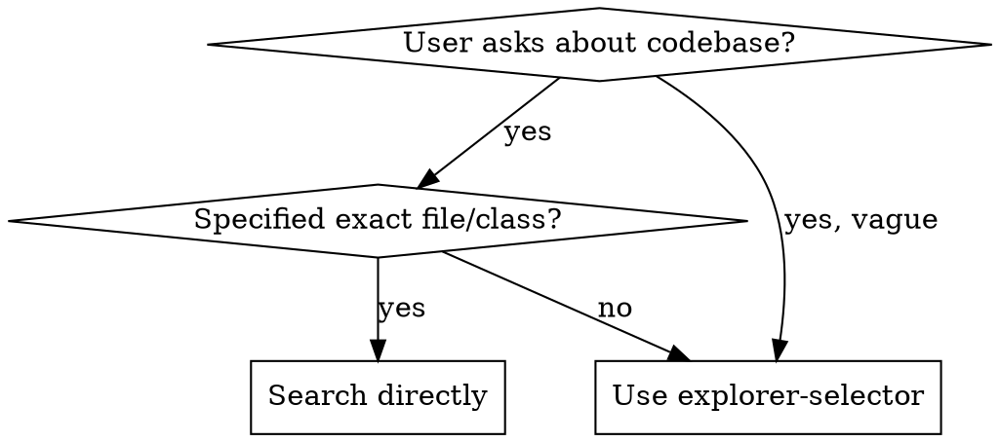

# Explorer Selector

## Overview

Prompts the user to choose an explorer agent depth, then launches the corresponding `Task` with `subagent_type=explore`.
Saves context by delegating exploration to a subagent while keeping the main session focused.

## When to Use

**Use when:**

- User asks "how does X work?" without a specific file
- User wants to understand code structure or architecture
- User needs to find where something is implemented
- User's request is ambiguous — exploration clarifies scope

**Don't use when:**

- User specifies exact file/class/function — search directly
- User provides a specific glob or grep pattern
- Task is purely informational (no codebase context needed)

## Options

| Depth             | Use Case                                             | Agent                | Model                                                 | Prompt pattern                                     |
|-------------------|------------------------------------------------------|----------------------|-------------------------------------------------------|----------------------------------------------------|
| **quick**         | "Where is X?", "What does Y do?"                     | `explore-quick`      | `google/gemini-3.-flash-lite`                         | Basic file search, single concept                  |
| **medium**        | "How does Z work?", "Show me the flow"               | `explore-medium`     | `opencode/deepseek-v4-flash-free` (temp 0.1, top_p 1) | Multiple patterns, follows references              |
| **very thorough** | "Explain this architecture", "Find all related to X" | `explore` (built-in) | Default model                                         | Comprehensive, includes git history, related files |

## Execution

1. Use the `Question` tool to ask the user to pick a depth (quick / medium / very thorough).
2. Launch a `Task` with `subagent_type` matching the agent for the chosen depth:
    - **quick** → `subagent_type=explore-quick`
    - **medium** → `subagent_type=explore-medium`
    - **very thorough** → `subagent_type=explore`
3. Relay the result back to the user.

## Common Mistakes

- **Skipping the selector for ambiguous questions** — if you're unsure what the user needs, ask. Guessing wrong wastes
  more context than the selector.
- **Over-selecting for trivial lookups** — if the user says "read src/foo/Bar.java", use `Read` directly, not the
  selector.
- **Descriptions that don't match depth** — "quick" should describe a focused, single-concept search. "very thorough"
  should describe multi-pattern exploration.
