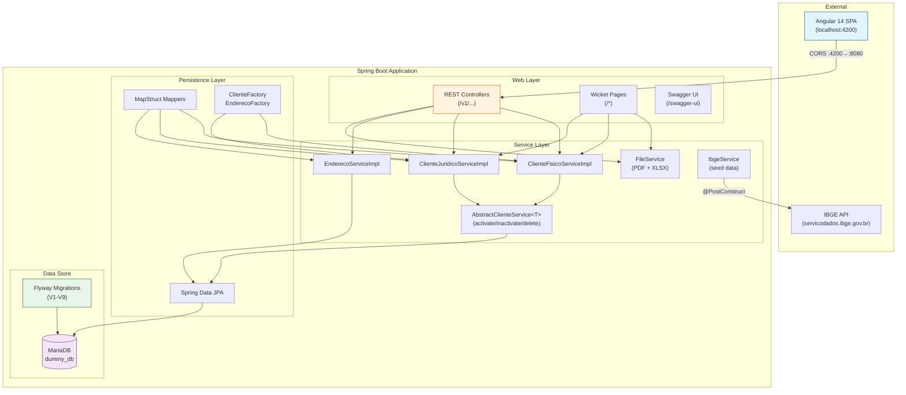
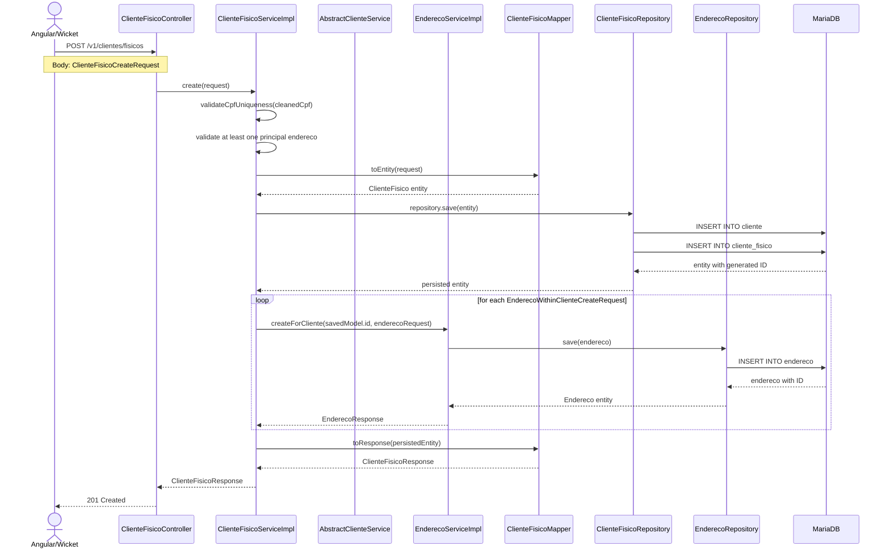
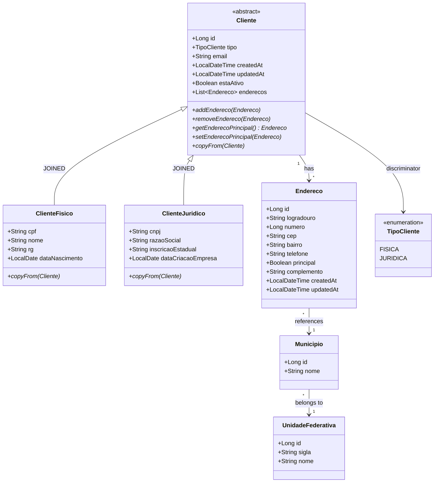
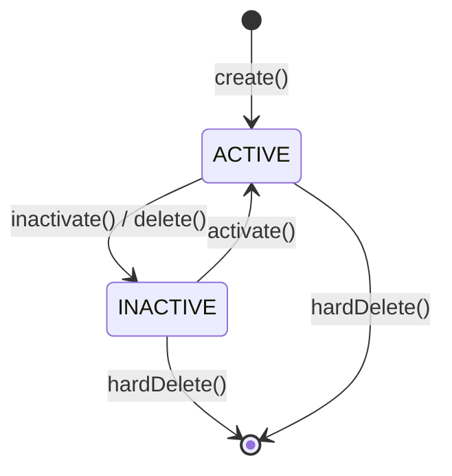
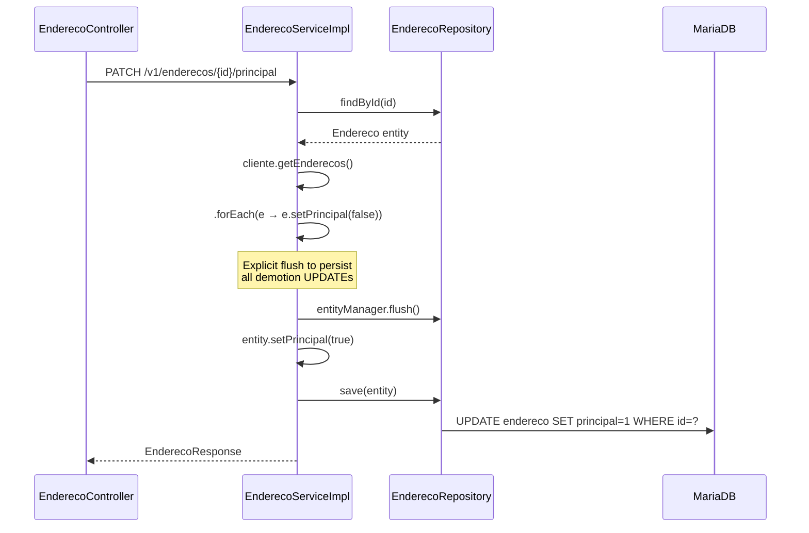
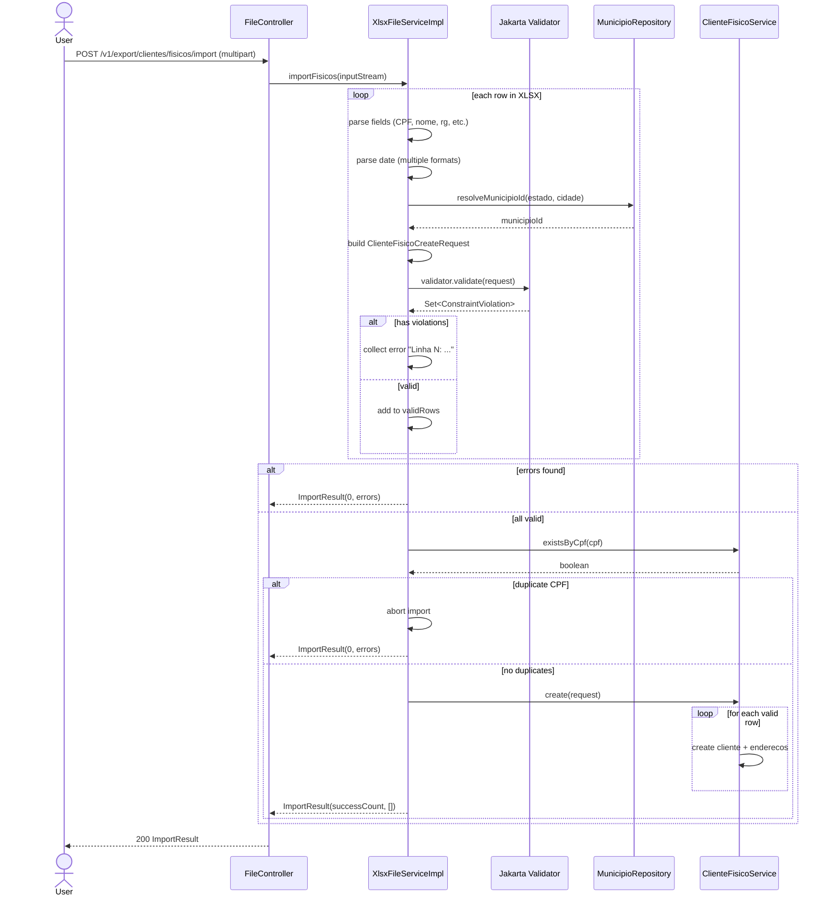
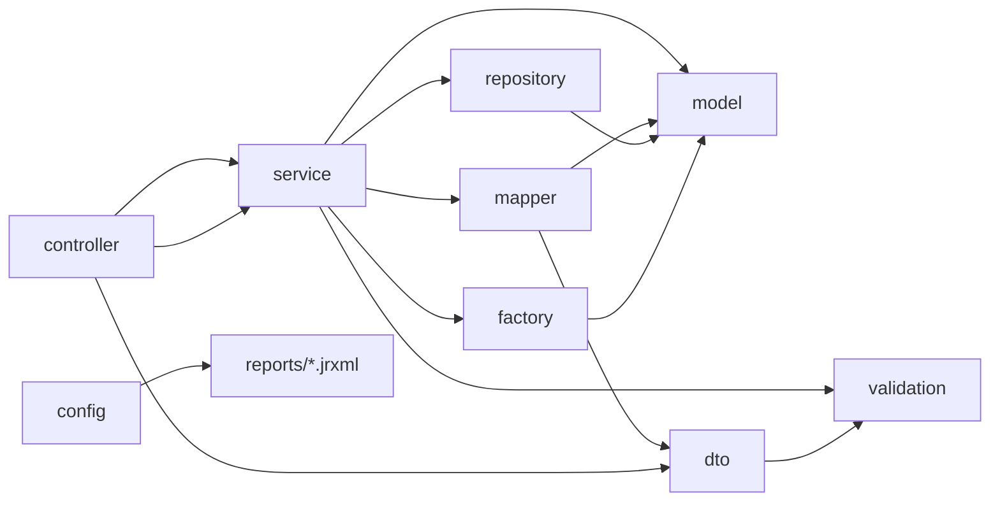
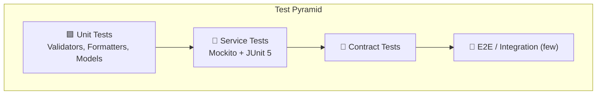

# Unika Estágio — Spring Backend Architecture

## Executive Summary

Client management REST API + Wicket server-rendered UI for Brazilian individual (`ClienteFisico`) and corporate (`ClienteJuridico`) clients. Supports full CRUD with address lifecycle management, fuzzy search, PDF/XLSX reporting via JasperReports and Apache POI, and bulk XLSX import. Uses Flyway for schema migrations, MapStruct for DTO mapping, and a layered architecture with `AbstractClienteService<T>` as the shared template for lifecycle operations (activate/inactivate/soft-delete/hard-delete).

## Architecture Diagrams

### Layered System Context



### Full Request Flow: Create Individual Client



### Entity Relationship Diagram



### Client Lifecycle State Machine



## Folder Structure

```
📁 com/desafio/estagio/
├── 📄 EstagioApplication.java         # @SpringBootApplication entry point
├── 📁 config/                          # Spring @Configuration classes
│   ├── 📄 JasperReportsConfig.java     # Compiles .jrxml → Map<String, JasperReport>
│   ├── 📄 OpenApiCustomizerConfig.java # Tags operationId with sanitized prefix
│   ├── 📄 WebConfig.java               # CORS for Angular on :4200
│   └── 📄 WicketConfig.java            # WicketFilter registration, ignores /v1/**
├── 📁 controller/                      # REST endpoints
│   ├── 📄 ClienteFisicoController.java # /v1/clientes/fisicos
│   ├── 📄 ClienteJuridicoController.java # /v1/clientes/juridicos
│   ├── 📄 EnderecoController.java      # /v1/enderecos
│   ├── 📄 MunicipioController.java     # /v1/municipios (read-only)
│   ├── 📄 UnidadeFederativaController.java # /v1/unidades-federativas (read-only)
│   └── 📄 FileController.java          # /v1/export (PDF, XLSX, import)
├── 📁 dto/                             # Immutable records per domain
│   ├── 📁 clientefisico/               # ClienteFisicoCreate/Update/Response/List/Report
│   ├── 📁 clientejuridico/             # ClienteJuridicoCreate/Update/Response/List/Report
│   ├── 📁 endereco/                    # Endereco R/W DTOs + sanitizer/
│   ├── 📁 municipio/                   # MunicipioDTO
│   └── 📁 unidadefederativa/           # UnidadeFederativaDTO
├── 📁 exceptions/                      # Custom exceptions + global handler
│   ├── 📄 BusinessException.java       # 422 Unprocessable Entity
│   ├── 📄 ConflictException.java       # 409 Conflict
│   ├── 📄 ResourceNotFoundException.java # 404 Not Found
│   └── 📁 handlers/
│       ├── 📄 GlobalExceptionHandler.java # @RestControllerAdvice
│       └── 📄 APIErrorResponse.java      # Standard error envelope
├── 📁 factory/                         # Object creation
│   ├── 📄 ClienteFactory.java          # Interface: create/clone by type
│   ├── 📄 ClienteFactoryImpl.java      # EnumMap<Supplier> pattern
│   ├── 📄 EnderecoFactory.java         # Interface: create/clone
│   └── 📄 EnderecoFactoryImpl.java     # Shallow clone with field copy
├── 📁 mapper/                          # MapStruct interfaces
│   ├── 📄 ClienteFisicoMapper.java     # Entity ↔ DTO, formatters for CPF
│   ├── 📄 ClienteJuridicoMapper.java   # Entity ↔ DTO, formatters for CNPJ
│   └── 📄 EnderecoMapper.java          # Entity ↔ DTO, nested municipio/UF
├── 📁 model/                           # JPA entities
│   ├── 📄 Cliente.java                 # Abstract base with @Inheritance(JOINED)
│   ├── 📄 ClienteFisico.java           # Extends Cliente (cpf, nome, rg, nascimento)
│   ├── 📄 ClienteJuridico.java         # Extends Cliente (cnpj, razaoSocial, IE)
│   ├── 📄 Endereco.java                # Address with principal flag logic
│   ├── 📄 Municipio.java               # IBGE municipality reference data
│   ├── 📄 UnidadeFederativa.java       # Brazilian state (UF)
│   ├── 📁 enums/
│   │   └── 📄 TipoCliente.java         # FISICA | JURIDICA
│   └── 📁 formatter/                   # Display formatters
│       ├── 📄 CPFFormatter.java        # 12345678901 → 123.456.789-01
│       ├── 📄 CNPJFormatter.java       # + checksum validation
│       ├── 📄 RGFormatter.java         # 7-9 digit formatting
│       ├── 📄 CEPFormatter.java        # 01234567 → 01234-567
│       └── 📄 TelefoneFormatter.java   # (11) 91234-5678
├── 📁 repository/                      # Spring Data JPA
│   ├── 📄 ClienteRepository.java       # Generic base for Cliente hierarchy
│   ├── 📄 ClienteFisicoRepository.java # Fuzzy search, CPF/RG/email lookups
│   ├── 📄 ClienteJuridicoRepository.java # Fuzzy search, CNPJ/IE/email lookups
│   ├── 📄 EnderecoRepository.java      # Scoped + global fuzzy search
│   ├── 📄 MunicipioRepository.java     # Lookup by UF, fuzzy by nome+sigla
│   └── 📄 UnidadeFederativaRepository.java # Find by sigla
├── 📁 service/                         # Business logic
│   ├── 📄 AbstractClienteService.java  # Template: activate/inactivate/delete/hardDelete
│   ├── 📄 ClienteFisicoService.java    # Composite of Query + Lifecycle
│   ├── 📄 ClienteJuridicoService.java  # Composite of Query + Lifecycle
│   ├── 📄 EnderecoService.java         # CRUD + principal promotion logic
│   ├── 📄 FileService.java             # Façade: PDF + XLSX + import
│   ├── 📄 IbgeService.java             # @PostConstruct seed from IBGE API
│   ├── 📄 JasperReportService.java     # Compile+fill+export for .jrxml
│   ├── 📁 impl/
│   │   ├── 📄 ClienteFisicoServiceImpl.java
│   │   ├── 📄 ClienteJuridicoServiceImpl.java
│   │   ├── 📄 EnderecoServiceImpl.java
│   │   ├── 📄 JasperReportServiceImpl.java
│   │   ├── 📄 PdfFileServiceImpl.java
│   │   └── 📄 XlsxFileServiceImpl.java
│   ├── 📁 lifecycle/
│   │   ├── 📄 ClienteFisicoLifecycleService.java # Create/Update/Delete interface
│   │   └── 📄 ClienteJuridicoLifecycleService.java
│   └── 📁 query/
│       ├── 📄 ClienteFisicoQueryService.java # Read-only query ops
│       └── 📄 ClienteJuridicoQueryService.java
└── 📁 validation/                      # Custom Bean Validation
    ├── 📄 ValidationConstants.java     # Centralized length limits
    ├── 📁 annotation/
    │   ├── 📄 ValidCEP.java
    │   ├── 📄 ValidCNPJ.java
    │   ├── 📄 ValidCPF.java
    │   ├── 📄 ValidRG.java
    │   └── 📄 ValidTelefone.java
    └── 📁 internal/
        ├── 📄 CEPValidator.java        # 8 digits + regex
        ├── 📄 CNPJValidator.java       # 14 digits + checksum
        ├── 📄 CPFValidator.java        # 11 digits + checksum
        ├── 📄 RGValidator.java         # 7-9 digits
        └── 📄 TelefoneValidator.java   # 10-11 digits
```

## Module Breakdown

### config/

| Class | Responsibility | Key Beans |
|---|---|---|
| `JasperReportsConfig` | Scans `classpath:reports/*.jrxml`, compiles to `Map<String, JasperReport>` | `jasperReports()` |
| `OpenApiCustomizerConfig` | Sanitizes tag names (removes accents), prefixes operationId | `operationIdCustomizer()` |
| `WebConfig` | CORS for Angular dev server `localhost:4200` | `addCorsMappings` → `/v1/**` |
| `WicketConfig` | `FilterRegistrationBean<WicketFilter>` ignoring `/v1,/swagger-ui` | `wicketFilterRegistration()` |

### controller/

| Controller | Base Path | Primary Methods |
|---|---|---|
| `ClienteFisicoController` | `/v1/clientes/fisicos` | `GET/POST/PUT/PATCH/DELETE` + `/search`, `/ativos`, `/cpf/{cpf}` |
| `ClienteJuridicoController` | `/v1/clientes/juridicos` | `GET/POST/PUT/PATCH/DELETE` + `/search`, `/ativos`, `/cnpj/{cnpj}` |
| `EnderecoController` | `/v1/enderecos` | `POST/GET/PUT/PATCH/DELETE` + `/clientes/{id}/...`, `/search` |
| `MunicipioController` | `/v1/municipios` | `GET ?ufSigla=` — list with optional UF filter |
| `UnidadeFederativaController` | `/v1/unidades-federativas` | `GET` — all UFs ordered by name |
| `FileController` | `/v1/export` | PDF/XLSX export + template download + XLSX import |

### dto/

| Package | Records | Purpose |
|---|---|---|
| `clientefisico/` | `*CreateRequest`, `*UpdateRequest`, `*Response`, `*ListResponse`, `*ReportResponse` | Full CRUD + report DTOs |
| `clientejuridico/` | Same pattern as above | Full CRUD + report DTOs |
| `endereco/` | `*CreateRequest`, `*WithinClienteCreateRequest`, `*UpdateRequest`, `*Response`, `*ListResponse`, `*ReportResponse` | Address DTOs + sanitizer utils |
| `municipio/` | `MunicipioDTO` | Flat `(id, nome, siglaUF)` view |
| `unidadefederativa/` | `UnidadeFederativaDTO` | Flat `(id, sigla, nome)` view |

### exceptions/

| Exception | HTTP Status | When |
|---|---|---|
| `BusinessException` | 422 Unprocessable Entity | Business rule violations (e.g., client already inactive) |
| `ConflictException` | 409 Conflict | Duplicate CPF/CNPJ |
| `ResourceNotFoundException` | 404 Not Found | Entity not found by ID |

`GlobalExceptionHandler` (`@RestControllerAdvice`) also handles: `MethodArgumentNotValidException` (400), `ConstraintViolationException` (400), `DataIntegrityViolationException` (409), plus fallback `Exception` → 500.

### factory/

| Interface | Implementation | Pattern |
|---|---|---|
| `ClienteFactory` | `ClienteFactoryImpl` | `EnumMap<TipoCliente, Supplier<Cliente>>` — creates typed clients with default address |
| `EnderecoFactory` | `EnderecoFactoryImpl` | Creates blank or cloned `Endereco` |

### mapper/

| Mapper | Component Model | Features |
|---|---|---|
| `ClienteFisicoMapper` | Spring, constructor injection | Formats CPF via `CPFFormatter`, ignores CPF/RG on update, constant `tipo=FISICA` |
| `ClienteJuridicoMapper` | Spring, constructor injection | Formats CNPJ via `CNPJFormatter`, ignores CNPJ on update, constant `tipo=JURIDICA` |
| `EnderecoMapper` | Spring, `disableBuilder = true` | Flattens `municipio.nome` → `cidade`, `municipio.uf.sigla` → `estado` |

### model/

Key entity design decisions:

- **`Cliente`** (`abstract`): `@Inheritance(strategy = JOINED)` — shared table `cliente` + child tables `cliente_fisico` / `cliente_juridico`. Manages its own address list invariants via `addEndereco()` / `removeEndereco()` / `setEnderecoPrincipal()`.
- **`Endereco`**: `@ManyToOne` to both `Cliente` and `Municipio`. Setter sanitizers strip non-digits from CEP and telefone. `@PreRemove` guards against removing the principal address.
- **`Municipio` / `UnidadeFederativa`**: Read-only reference data, seeded from IBGE API on first startup.

### repository/

| Repository | Key Query Methods |
|---|---|
| `ClienteFisicoRepository` | `findByCpf`, `search` (fuzzy across nome/CPF/RG/email), `findByDataNascimentoBetween`, bulk `inactivateAllByIds` |
| `ClienteJuridicoRepository` | `findByCnpj`, `search` (fuzzy across razaoSocial/CNPJ/IE/email), `findByDataCriacaoEmpresaBetween`, bulk ops |
| `EnderecoRepository` | `findByClienteId`, `findByClienteIdAndPrincipalTrue`, `search` (fuzzy across logradouro/bairro/cidade/cep), scoped search |
| `MunicipioRepository` | `findByUnidadeFederativaSiglaOrderByNome`, `fuzzyFindByNomeAndSigla` |
| `UnidadeFederativaRepository` | `findBySigla`, `findAllByOrderByNome` |

### service/

Key service design:

- **`AbstractClienteService<T>`**: Template with `activate()`, `inactivate()`, `delete()` (→ inactivate), `hardDelete()` (demotes addresses first). Subclasses provide `getEntityName()`.
- **`ClienteFisicoServiceImpl`**: Extends `AbstractClienteService`, implements `ClienteFisicoService` (which combines `ClienteFisicoQueryService` + `ClienteFisicoLifecycleService`). Creates client first, then addresses via `EnderecoService.createForCliente()`.
- **`EnderecoServiceImpl`**: Full CRUD with principal address promotion/demotion logic. Uses explicit `entityManager.flush()` between demotion and promotion to avoid UK violations.
- **`XlsxFileServiceImpl`**: Apache POI — generates XLSX reports, templates, and imports with row-level validation (Bean Validation + business rules). Uses `resolveMunicipioId()` for city→IBGE lookup.

### validation/

| Annotation | Validator | Rule |
|---|---|---|
| `@ValidCPF` | `CPFValidator` | 11 digits + checksum verification |
| `@ValidCNPJ` | `CNPJValidator` | 14 digits + checksum verification |
| `@ValidRG` | `RGValidator` | 7-9 digits |
| `@ValidCEP` | `CEPValidator` | Exactly 8 digits |
| `@ValidTelefone` | `TelefoneValidator` | 10-11 digits |

All length limits centralized in `ValidationConstants.java` — never hardcoded.

## API Surface

### ClienteFisico — `/v1/clientes/fisicos`

| Method | Path | Parameters | Returns |
|---|---|---|---|
| `GET` | `/` | `Pageable` | `Page<ClienteFisicoListResponse>` |
| `GET` | `/search?q=` | `q` (String), `Pageable` | `Page<ClienteFisicoListResponse>` |
| `GET` | `/ativos` | `Pageable` | `Page<ClienteFisicoListResponse>` |
| `GET` | `/{id}` | `id` (Long) | `ClienteFisicoResponse` |
| `GET` | `/cpf/{cpf}` | `cpf` (String) | `ClienteFisicoResponse` |
| `GET` | `/cpf/{cpf}/exists` | `cpf` (String) | `Boolean` |
| `GET` | `/relatorio` | `Pageable` | `Page<ClienteFisicoReportResponse>` |
| `POST` | `/` | Body: `ClienteFisicoCreateRequest` | `201` → `ClienteFisicoResponse` |
| `PUT` | `/{id}` | Body: `ClienteFisicoUpdateRequest` | `ClienteFisicoResponse` |
| `PATCH` | `/{id}/ativar` | — | `204` |
| `PATCH` | `/{id}/inativar` | — | `204` |
| `DELETE` | `/{id}` | — | `204` (soft) |
| `DELETE` | `/{id}/permanent` | — | `204` (hard) |

### ClienteJuridico — `/v1/clientes/juridicos`

Same pattern as Fisico, replacing CPF → CNPJ, nome → razaoSocial, dataNascimento → dataCriacaoEmpresa. No `/inativar` (soft delete only via `DELETE /{id}` which is actually hard delete).

### Endereco — `/v1/enderecos`

| Method | Path | Parameters | Returns |
|---|---|---|---|
| `POST` | `/` | Body: `EnderecoCreateRequest` | `201` → `EnderecoResponse` |
| `POST` | `/clientes/{clienteId}` | Body: `EnderecoWithinClienteCreateRequest` | `201` → `EnderecoResponse` |
| `GET` | `/{id}` | — | `EnderecoResponse` |
| `GET` | `/clientes/{clienteId}` | `Pageable` | `Page<EnderecoListResponse>` |
| `GET` | `/clientes/{clienteId}/principal` | — | `EnderecoResponse` |
| `GET` | `/clientes/{clienteId}/count` | — | `Long` |
| `GET` | `/search?q=` | `q`, `Pageable` | `Page<EnderecoListResponse>` |
| `GET` | `/clientes/{clienteId}/search?q=` | `clienteId`, `q`, `Pageable` | `Page<EnderecoListResponse>` |
| `GET` | `/clientes/{clienteId}/has-addresses` | — | `Boolean` |
| `GET` | `/clientes/{clienteId}/has-principal` | — | `Boolean` |
| `PUT` | `/{id}` | Body: `EnderecoUpdateRequest` | `EnderecoResponse` |
| `PATCH` | `/{id}/principal` | — | `EnderecoResponse` |
| `DELETE` | `/{id}` | — | `204` |
| `DELETE` | `/clientes/{clienteId}` | — | `204` |

### Export/Import — `/v1/export`

| Method | Path | Returns |
|---|---|---|
| `GET` | `/clientes/fisicos/pdf?q=` | `application/pdf` |
| `GET` | `/clientes/juridicos/pdf?q=` | `application/pdf` |
| `GET` | `/clientes/{clienteId}/enderecos/pdf` | `application/pdf` |
| `GET` | `/clientes/fisicos/xlsx?q=` | XLSX |
| `GET` | `/clientes/juridicos/xlsx?q=` | XLSX |
| `GET` | `/clientes/{clienteId}/enderecos/xlsx` | XLSX |
| `GET` | `/clientes/fisicos/template` | XLSX template |
| `GET` | `/clientes/juridicos/template` | XLSX template |
| `GET` | `/enderecos/template` | XLSX template |
| `POST` | `/clientes/fisicos/import` | `ImportResult` |
| `POST` | `/clientes/juridicos/import` | `ImportResult` |
| `POST` | `/enderecos/import` | `ImportResult` |

### Reference Data

| Method | Path | Returns |
|---|---|---|
| `GET` | `/v1/municipios?ufSigla=` | `List<MunicipioDTO>` |
| `GET` | `/v1/unidades-federativas` | `List<UnidadeFederativaDTO>` |

## Data Flow

### Endereco Principal — Promotion Flow (setAsPrincipal)



### File Import Flow



## Dependencies

### Module Dependency Graph



### External Dependencies

| Dependency | Version | Purpose |
|---|---|---|
| Spring Boot (WebMVC, Data JPA, JDBC) | 4.0.6 | REST, JPA, data access |
| SpringDoc OpenAPI | 3.0.2 | Swagger UI at `/swagger-ui` |
| Apache Wicket | 7.17.0 | Server-rendered UI |
| MariaDB Connector/J | 9.7.0 | JDBC driver |
| Flyway | 12.5.0 | Schema migrations |
| MapStruct | 1.6.3 | DTO ↔ Entity mapping |
| JasperReports | 7.0.6 | PDF generation from `.jrxml` |
| Apache POI | 5.5.1 | XLSX export/import |
| Lombok | Latest | Boilerplate reduction |
| Log4j + SLF4J | 2.25.4 | Logging |
| JAXB | 2.3.1 | XML marshalling (JasperReports) |

## Configuration

### application.properties

| Property | Value | Purpose |
|---|---|---|
| `spring.datasource.url` | `jdbc:mysql://localhost:3306/dummy_db` | JDBC connection |
| `spring.datasource.username` | `root` | DB user |
| `spring.datasource.password` | `mariadb` | DB password |
| `spring.jpa.hibernate.ddl-auto` | `validate` | Schema validation via Flyway |
| `spring.jpa.show-sql` | `true` | SQL logging |
| `spring.jpa.properties.hibernate.dialect` | `MariaDBDialect` | Hibernate dialect |
| `spring.flyway.enabled` | `true` | Flyway active |
| `spring.flyway.locations` | `classpath:db/migration/main` | Migration scripts path |
| `springdoc.use-fqn` | `true` | Fully qualified names in OpenAPI |

### CORS

Allowed origins: `http://localhost:4200` (Angular dev server). Methods: `GET, POST, PUT, DELETE, OPTIONS`. Credentials enabled.

### Flyway Migrations

| Migration | Description |
|---|---|
| `V1__ClienteEntity.sql` | Base `cliente` table |
| `V2__ClienteFisicoEntity.sql` | `cliente_fisico` child table |
| `V3__ClienteJuridicoEntity.sql` | `cliente_juridico` child table |
| `V4__EnderecoEntity.sql` | `endereco` table with FK to cliente |
| `V5__AlterRgConstraint.sql` | RG length/format constraints |
| `V6__AlterEnderecoTelefoneNullable.sql` | Telefone → nullable |
| `V7__CreateUnidadeFederativaTable.sql` | UF reference table |
| `V8__CreateMunicipioTable.sql` | Municipio reference table |
| `V9__AddMunicipioForeignKeyToEndereco.sql` | FK from endereco → municipio |

[!tip]
> The `ddl-auto=validate` setting means Hibernate checks entities against the actual DB schema. All schema changes MUST go through Flyway migrations, not JPA auto-DDL.

## Testing Strategy

### Test Pyramid



### Test Structure

```
📁 src/test/java/com/desafio/estagio/
├── 📁 config/
│   └── 📄 TestConfig.java
├── 📁 controller/
│   ├── 📄 ClienteFisicoControllerTest.java
│   ├── 📄 ClienteJuridicoControllerTest.java
│   └── 📄 EnderecoControllerTest.java
├── 📁 dto/endereco/
│   └── 📄 EnderecoRequestValidationTest.java
├── 📁 integration/
│   └── 📄 AbstractIntegrationTest.java
├── 📁 model/
│   ├── 📄 ClienteModelTest.java
│   ├── 📄 EnderecoModelTest.java
│   ├── 📄 DateParsingTest.java
│   └── 📁 formatter/
│       ├── 📄 CEPFormatterTest.java
│       ├── 📄 CNPJFormatterTest.java
│       ├── 📄 CPFFormatterTest.java
│       ├── 📄 RGFormatterTest.java
│       └── 📄 TelefoneFormatterTest.java
├── 📁 service/
│   ├── 📄 AbstractServiceTest.java
│   ├── 📄 AbstractClienteServiceTest.java
│   └── 📁 impl/
│       ├── 📄 ClienteFisicoServiceImplTest.java
│       ├── 📄 ClienteJuridicoServiceImplTest.java
│       └── 📄 EnderecoServiceImplTest.java
├── 📁 validation/internal/
│   ├── 📄 CEPValidatorTest.java
│   ├── 📄 CNPJValidatorTest.java
│   ├── 📄 CPFValidatorTest.java
│   ├── 📄 RGValidatorTest.java
│   └── 📄 TelefoneValidatorTest.java
└── 📁 wicket/ (excluded from scope)
    ├── 📄 WicketTestBase.java
    └── ...
```

### Test Commands

| Command | Purpose |
|---|---|
| `rtk gradlew test` | Run all tests |
| `rtk gradlew test --tests "*ClienteFisicoServiceImplTest*"` | Single test class |
| `rtk gradlew test --tests "*ValidatorTest*"` | All validator tests |
| `rtk gradlew cleanTest test` | Force re-run all tests |

[!tip]
> Integration tests use Testcontainers with MariaDB and Flyway test migrations at `classpath:db/migration/test`. Ensure Docker is running before executing integration tests.

## Troubleshooting

| Symptom | Likely Cause | Fix |
|---|---|---|
| `org.hibernate.exception.ConstraintViolationException: UK_cliente_endereco_principal_unico` | Principal address promotion without demoting the old one first | `EnderecoServiceImpl.setAsPrincipal()` already handles the flush pattern. If calling from custom code, demote all → flush → promote. |
| `org.springframework.dao.DataIntegrityViolationException: Duplicate entry` | CPF/CNPJ already exists | Check `existsByCpf()` / `existsByCnpj()` before create. The `ConflictException` mapper returns 409. |
| `could not initialize proxy — no Session` | Lazy `@OneToMany` accessed outside transaction | Use `@Transactional(readOnly = true)` at service, or add `fetch = FetchType.EAGER` on the relationship. |
| Wicket captures all paths including `/v1/...` | WicketFilter is mapped to `/*` with precedence over Spring DispatcherServlet | Check `ignorePaths` in `WicketConfig.java` includes `/v1,/swagger-ui,/v3/api-docs`. |
| `net.sf.jasperreports.engine.JRException: Report not found` | `.jrxml` file missing from `classpath:reports/` | Verify file exists at `src/main/resources/reports/`. Check `JasperReportsConfig` logs for "Found N .jrxml file(s)". |
| XLSX import fails silently for a row | Missing required field or invalid date format | Check `DateFormat` patterns accepted: `yyyy-MM-dd`, `dd/MM/yyyy`, `dd-MM-yyyy`, `yyyy/MM/dd`. |
| `IllegalStateException: Cliente must have at least one endereco` | Attempting to remove the last address of a client | The `Cliente.removeEndereco()` method throws when `enderecos.size() <= 1`. Guard with `countByClienteId()`. |
| Wicket HTML template not found (404) | HTML file not packaged in the WAR classpath | The `build.gradle` includes `**/*.html` from `src/main/java` via both `war` and `processResources` tasks. |

## Related Documents

- [[../../../../../../../AGENTS.md|Monorepo AGENTS.md]] — Project-level conventions and anti-patterns
- [[../wicket/README.md|Wicket UI Layer]] — Server-rendered UI documentation
- [[../../../../../angular/src/README.md|Angular Frontend]] — Angular SPA that consumes REST endpoints
- [[../../../../../../../docs/database/SCHEMA.md|Database Schema]] — Entity-relationship model and migration history (stub)
- [[../../test/java/com/desafio/estagio/README.md|Test Suite Guide]] — Running tests, Testcontainers setup, and test conventions (stub)

[!warning]
> The `AbstractClienteService.activate()` and `.inactivate()` methods are `final`. Subtypes cannot override them. If you need per-type activation logic, inject a strategy or hook into the `ClienteFisicoLifecycleService` / `ClienteJuridicoLifecycleService` interface instead.
